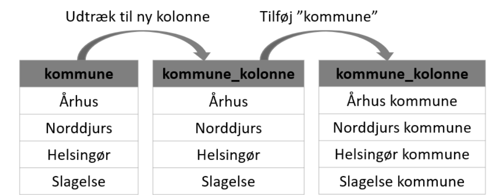
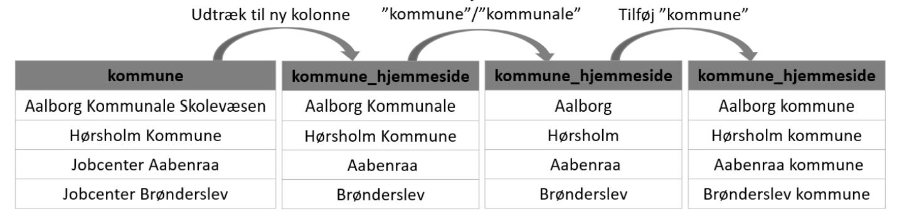
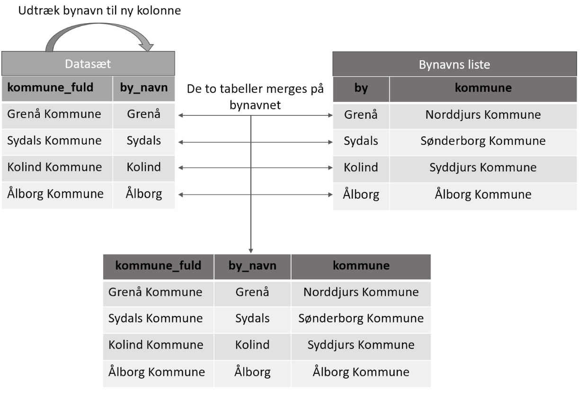
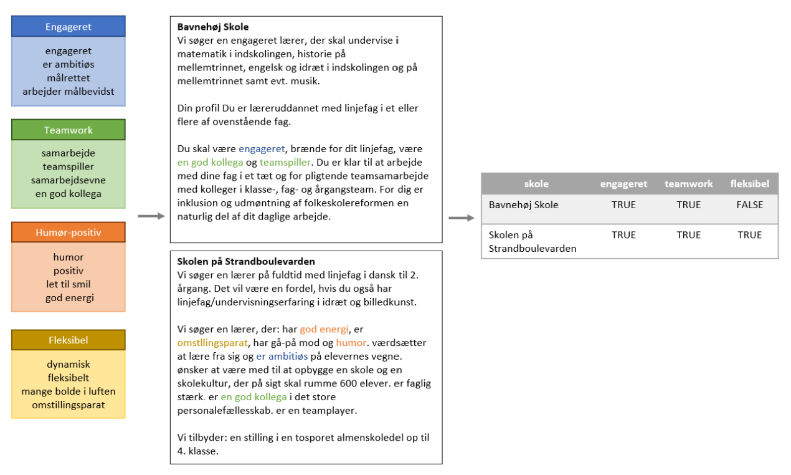

# Indæsning af pakker
```{r}
# Til at indlæse
library(readr)

# Til at lave id
library(tidyverse)

# Indlæs Excel 
library(readxl)

# Til at håndterer datoer 
library(lubridate)

# Til string metoder
library(stringr)

install.packages("quanteda")
library(quanteda)

# Anvendes til at finde dupletter i skolenavne
library(data.table)

# Anvendes til at udtrække koefficienter, R^2 og p-værdier for regessioner
library(tidyverse)
library(broom)

# Anvendes til at udtrække regressionskoefficienter til en liste
library(nlme)

# Anvendes til plots
library(ggplot2)


# Anvendes til at printe outputtet fra regressionerne
#install.packages("stargazer")
library("stargazer")

# Anvendes til at konstruere et sæsonalitetsplot
#install.packages("fpp2")
library(fpp2)

# Anvendes til at teste for autokorrelation og til at plotte et korrelogram
library(lmtest)


# Indstillinger: Tal skal ikke skrives som videnskabelig og der skal være seks cifre
options(scipen = 999)
options(digits = 6)

```


_____________________________________________________________________________________________________________

############################################################ 
# Indlæsning af data
############################################################

Forud for indlæsningen af csv-filen er:  

* Kolonnerne undersøgt i RStudio og rettet til i Notepad++  
* Tilddelt kolonnerne navne 
* Tekst-kolonne blevet renset i Python, da `.str.replace()`-metoden der, fungerer betydeligt hurtigere en `gsub()`-metoden i R  

```{r}
jobs_data <- read_csv("../datasets/laerer_test_renset.csv")
```


Dataet overskrives for at fjerne de irrelevante kolonner:

* url  
* første_linje  
* tekst (da den er renset i en anden kolonne)
* annonceid

```{r}
jobs_data <- jobs_data[,-c(1, 9:11)]
```


"test_tekst"-kolonnen, som er den rensede tekst-kolonne omdøbes til "tekst"
```{r}
jobs_data <- jobs_data %>% 
  rename(tekst = test_tekst)
```


_____________________________________________________________________________________________________________


############################################################ 
# Fjern opslag uden tekst eller med ugyldig teks
############################################################

**Fjern opslag uden tekst**
Der laves kopi af det originale dataframe, for ikke at overskrive denne ved et uheld

```{r}
jobs_teacher <- jobs_data[!(is.na(jobs_data$tekst)), ]
```


**Fjern ugyldige opslag**
Liste over tekst for opslag der er ugylidge  

```{r}
missing_opslag <- c(
  "www.jobfinder.dk Javascript er nødvendigt for at bruge dette website. Du kan i din browserdokumentation se, hvordan man aktiverer Java Script Klik her for at komme til forsiden.", 
  "Offentlige Stillinger Your browser does not support frames. Please get one that does..",
  "Siden findes ikke Det kan skyldes at: Siden er blevet fjernet. Du har indtastet en forkert webadresse",
  "Annoncen er ikke længere tilgængelig. Udskriv Tilbage*",
  "Your browser does not support frames. Please get one that",
  "- - - - - - - - - - -",
  "- - - - - -",
  "	__ANKIRO__",
"Annonce udløbet Den ønskede annonce er udløbet, og vise"
)
```


Opslag der indeholder udtrykkene i listen sorteres fra

```{r}
jobs_teacher <- jobs_teacher %>% 
  filter(!grepl(paste(missing_opslag, collapse = "|"),tekst, ignore.case = TRUE))

rm(missing_opslag)
```

_____________________________________________________________________________________________________________

<br>

############################################################ 
# Agræns til læreropslag mellem 2007-2022
############################################################

**Der afgrænses til "laerer" kategorien**
```{r}
jobs_teacher <- jobs_teacher %>% 
  filter(kategori == "laerer")
```


**Afgræns til 2007-2022**  
Ændrer formatteringen på dato-kolonnen, så den læses år-måned-dag
```{r}
jobs_teacher["dato"] <- lubridate::ymd(jobs_teacher$dato)
```

Årstallet fra dato-kolonnen trækkes ud til en ny kolonne
```{r}
jobs_teacher["aar"] <- format(jobs_teacher$dato, format = "%Y")
```

Frasorter opslag fra 2005 og 2006
```{r}
jobs_teacher <- jobs_teacher %>% 
  filter(!grepl("2005|2006", aar, ignore.case = TRUE))
```

_____________________________________________________________________________________________________________

############################################################ 
# Agræns til danske opslag
############################################################

**Frasorter udenlandske opslag**
Der indlæses en liste over navne der er fundet i kommune-kolonnen
```{r}
Lok_excel <- read_excel('../datasets/Ikke-danske_lokationer.xlsx')
```

Loc_excel anvendes nu til at frasortere udenlandske opslag 
```{r}
jobs_teacher <- jobs_teacher %>% 
  filter(!grepl(paste(Lok_excel$Kommune, collapse = "|"), kommune, ignore.case = TRUE))

rm(Lok_excel)
```


_____________________________________________________________________________________________________________

############################################################ 
# Agræns til folkeskoleopslag
############################################################

**Frasortering på tekstkolonnen**  
Der genereres en liste med udtryk fra skoler og arbejdspladser der ikke ønskes undersøgt   
```{r}
frasorter_job <- c(
  "geolog*",
  "drama*",
  "højskole*",
  "produktionshøjskole*",
  "*efterskole*",
  "friskole*",
  "fri skole*",
  "specialskole*",
  "special skole*",
  "autisme*",
  "ordblindeundervisning",
  "efterskole*",
  "hospital*",
  "hospitalskole*",
  "hospital skole*",
  "privatskole*",
  "privat skole*", 
  "produktionsskole",
  "produktions skole",
  "dagsbehandlingsinstitution*",
  "dagsbehandlings institution*",
  "dagbehandling*",
  "dagbe handling*",
  "international folkeskole*",
  "gymnasie*",
  "gymnasium*",
  "high school*",
  " hf ",
  "handelsskole*",
  "teknisk skole*",
  "pædagogmedhjælper*",
  "pædagog medhjælper*",
  "servicemedarbejder*",
  "service medarbejder*",
  "vuc", 
  "forsvaret*",
  "flyveskole*",
  "flyve skole*",
  "*konsulent*", 
  "dyr- og jordbrugsskole*",
  "jordbrugsskole*",
  "jordbrugs skole*",
  "lektor*",
  "lectur*",
  "adjunkt*",
  "aftenskolelærer*",
  "aften skolelærer*",
  "aften skole lærer*",
  "lederstilling*",
  "kursusleder*",
  "redningsberedskab*",
  "miljøterapeut*",
  "projektmedarbejder*",
  "feelance underviser*",
  "pædagogisk leder*",
  "tale-høre-lærer*",
  "voksenundervis*",
  "aftenskole*",
  "designskole*",
  "kørelærer*",
  "kørekort*",
  "social- og sundhed*",
  "erhversuddan*",
  "erhversskole*",
  "euc",
  "konfirma*",
  "mekaniker*", 
  "sygepleje*",
  "værksted*",
  "erhvervsøkonomi*",
  "faglære*",
  "grundforløb*",
  "hovedforløb*",
  "sundhedshjælp*",
  "sprogcenter*",
  "ikea",
   "syge børn",
  "psykiatrisk*",
  "underviser i klaver",
  "asylansøge*",
  "logopæd*",
  "mentiqa",
  "dansk flygtningehjælp",
  "det kongelige kunst*",
  "kadk",
  "tandplej*",
  "graduate underviser*", 
  "freelance*", 
  "kulturskole*",
  "sproghus*",
  "redaktør*", 
  "teach first*", 
  "skolepraktik*",
  "geodata*",
  "arbetsuppgifter*",
  "kontorekspedition*",
  "danskbureauet*",
  "UNESCO*",
  "banker",
  "u.n.i",
  "produktion og salg",
  " FOF ",
  "fængsel",
  "konsulent", 
  "language*",
  "teacher global",
  "restaurantskolen",
  "ældre borgere*",
  "studentermedhjælp*",
  "kostskole*",
  "skilærer*",
  "muskskole*",
  "behandlingsskole*",
  "specialundervisningstilbud",
  "learn up",
  "moment",
  "sprogbureau*",
  "kindergarden*",
  " TESL ",
  " FGU ",
  " kdi ",
  " stu ",
  "Bo- og udviklingshus",
  "aftenskole*",
  "yoga", 
  "deutsche",
  "lehrer*",
  "schülern",
  "Steiner School",
  " DGI ",
  "Rescue Center",
  "fodterapeut*",
  "behandlingshjem*",
  "aabenraa ungdomsskole*",
  "realskole*",
  "musikskole*",
  "skibsprojekt*",
  "adventure*",
  "international school*",
  "kursister*",
  "billedskole*",
  "frie skole*",
  "olivia danmark*",
  "gardist*",
  "linguista",
  "tivoli*",
  "naturcenter*",
  "elever i udlandet",
  "ehversuddannelse*",
  "bygge teknik*",
  " eux ",
  "business college",
  "katolsk skole*",
  "rudolf steiner*",
  "0000013976 00000 n 0000014338 00000 n 0000014382 00000 n 0000015405 00000 n 0000016351 00000*",
  "ukaliusaq*",
  "atuarfik*",
  "taleinstitut*",
  "uddannelsescenter*",
  "fritidshjem*",
  "opholdssted*",
  "rennebu*",
  "vikarmatch",
  "study centre",
  "sprogskole",
  "integrationshus",
  "børnecenter*",
  "svømmeklub",
  "rideklub*",
  "frisør*",
  "bejtent*",
  "10. klasse campus",
  "aarhus tech*",
  "eud/eux",
  "teknisk eud",
  "gxu",
  "volunteer",
  "projektansættel*",
  "handicap*",
  "maritim*",
  "teacher*",
  "julekatalog*",
  "mir skolerne*",
  "fysioterape*",
  "dommerudnævnelsesrådet*",
  "voldgiftsnævnet*",
  "elektrik*",
  "språklärare*",
  "competative*",
  "anvikar",
  "UPTOO",
  "Grønlands Landsstyre",
  "Technical Education",
  "Airways",
  "Fysioterapeuter",
  "ANVIKAR",
  "volleyball"
)
```

Fjerner tekster med ovenstående ord i teksten 
```{r}
jobs_teacher_filter <- jobs_teacher %>% 
  filter(!grepl(paste(frasorter_job, collapse = "|"),tekst, ignore.case = TRUE))
```

### Fjerner ord med ovenstående ord i overskrift
```{r}
jobs_teacher_filter <- jobs_teacher_filter %>% 
  filter(!grepl(paste(frasorter_job, collapse = "|"),overskrift, ignore.case = TRUE))
```


**Frasotering kun på overskrift- og arbejdspladskolonnen**  
Liste med udtryk til overskrift
```{r}
frasorter_titel <- c(
  "administrativ medarbejder*",
  "afdelingsleder*",
  "børnehaveklasseleder*",
  "ungdomsskole*",
  "ordblinde*",
  "linie 10*",
  "10. klassecenter",
  "10. Klasse center",
  "undervise voksne",
  "fri grundskole",
  "aftenskole", 
  "\\bfof\\b",
  "pensionist",
  "fond*",
  "international",
  "skrædder*",
  "modersmålslærer",
  "hjemmeundervisning",
  "sex",
  "school",
  "private",
  "teach*",
  "ungdomsskole*",
  "gymnas*",
  "vive",
  "folketing*",
  "ministeriet",
  "domstol",
  "museum",
  "eminarieskole*",
  "filmskole*",
  "musikkonservatorium",
  "finance",
  "virksomhedsskole*",
  "hotel*",
  "dkdm",
  "aof",
  "blind*",
  "svømmelærer",
  "svømning",
  "fysio*",
  "taxa",
  "travel*",
  "selvejende",
  "læsevejleder",
  "behandling*",
  "asyl*",
  "celf",
  "heldagsskole*",
  "gulv*",
  "fonden*",
  "universitet",
  "erhverv*",
  "college",
  "dof",
  "golf*",
  "sang*",
  "ballet*",
  "\\blof\\b",
  "studenterkursus",
  "UPTOO",
  "Grønlands Landsstyre",
  "Technical Education",
  "efterskole",
  "heldagsskole",
  "Airways",
  "Fysioterapeuter",
  "ANVIKAR",
  "volleyball"
)
```

Fjerner ord med ovenstående ord i overskrift  
```{r}
jobs_teacher_filter <- jobs_teacher_filter %>% 
  filter(!grepl(paste(frasorter_titel, collapse = "|"),overskrift, ignore.case = TRUE))
```

Fjerner ord med ovenstående ord i arbejdsplads  
```{r}
jobs_teacher_filter <- jobs_teacher_filter %>% 
  filter(!grepl(paste(frasorter_titel, collapse = "|"),arbejdsplads, ignore.case = TRUE))
```

_____________________________________________________________________________________________________________


############################################################ 
# Find skolenavne
############################################################

Subset til data med relevante kolonner og filtrer opslag fra, hvor der ikke kunne findes kommunenavn
```{r}
jobs_teacher_filter <- jobs_teacher_filter[c("overskrift", "arbejdsplads", "kommune", "postnummer","hjemmeside", "dato", "tekst")]
```


**Registermetoden**  
Indlæsning af registerdata til at finde nogle skolenavne
```{r}
folkeskole_register <- read_excel("../datasets/Folkeskoler.xlsx")
```

"Job i området" afsnit fjernes fra opslange
```{r}
jobs_teacher_filter$tekst <- gsub("Job\\si\\sområdet.+www\\.specialpaedagogik\\.dk", "", jobs_teacher_filter$tekst, ignore.case = TRUE)

```

Find navne og udtræk dem i en ny kolonne
```{r}
jobs_teacher_filter$skolenavn_register = str_extract(
  jobs_teacher_filter$tekst, 
  pattern = regex(fixed(paste(folkeskole_register$INST_NAVN, collapse = "|"), ignore_case = TRUE))
)
```


Fjern 10. klasser fra skolenavn_register kolonnen
```{r}
jobs_teacher_filter <- jobs_teacher_filter %>% 
  filter(!grepl("10. klasse|10. ved Kløften",skolenavn_register, ignore.case = TRUE))
```


_____________________________________________________________________________________________________________

**Metoden med regulære udtryk**
Udtræk af skoleavne fra: 

* tekst-kolonnen          = skolenavn_regex  
* overskrifts-kolonnen    = skolenavn_overskrift      
* arbejdsplads-kolonnen   = skolenavn_arbejdsplads  


```{r}
jobs_teacher_filter <- jobs_teacher_filter %>% 
  mutate(skolenavn_regex = str_extract(tekst, '(?!.Om\\b|På|Om|Vores\\b|Ved|Til|til|på|Jobindex|[Kk]ommune|[Aa]fdeling|[Ff]aglig|[Ll]ærer|En|Øresundsregionen\\.|Et|[Kk]ontaktsperson|Næste|Barselsvikar|Barselsvikariat|[Ff]olkeskole(\\.?)|[Kk]ontakt|[Ff]agbladet|Arbejdsmarked|Arbejdsområde|Arbejdssted|Cookies|Eller Viceskole|Forrige|Forsiden|Ny|Genopslag|By|Da|Dag|Danmark|Denmark|Fastansat|Kommunale|Stillinger|Læsning|Nord|Stillinger|Søg|Virksomhed|Beliggenhed|Besøg|Bogbestilling|Book|Fedeste|Fransklærer|Fysiklærer|Gem|Hele|Hos|Idrætslærer|Naturfagslærer|Nedennævnte|Overenskomst|Oversigt|Profilskolen|Skolevæsen|Speciallærer|Viceleder|Vikariatet|Virksomhed|Behandlingstilbuddet|Jobzonen|Job|Skolen(n?)\\b|Timeløn)([A-Z|Æ|Ø|Å][a-z|å|ø|æ|é]+\\s[A-Z|Æ|Ø|Å][a-z|å|ø|æ|é]+skole(n?))|(?!.Om\\b|På|Om|Vores\\sskole|Ved|Til|til|på|Jobindex|[Kk]ommune|[Aa]fdeling|[Ff]aglig|[Ll]ærer|En|Øresundsregionen\\.|Et|[Kk]ontaktsperson|Næste|Barselsvikar|Barselsvikariat|[Ff]olkeskole(\\.?)|[Kk]ontakt|[Ff]agbladet|Åben [Ss]kole|Kommunale Skole|Arbejdssted|Årets skole|Attraktiv|Da(n?)|Del|Det(te?) skole|Elev Skole|Elevernes skole|Er|Se skolen|Fra skole|Grøn skole|Da skolen|Fordi skolen|Ny skole|Stilling|Arbejdsgiver|Arbejdsmarked|Arbejdsområde|Vores|Udviklingsorienteret|Mobning|Musiske|By|Den|Det|For|Forsiden|Foruden|Fransklærer|Il\\b|Intern|Intern|Mange|Med|Os|Overenskomst|Profil|Profilområde|Som|Stor(t?)|Tre|Ny)([A-Z|Æ|Ø|Å][a-z|å|ø|æ|ë]+\\s[Ss]kole(n?))|(?!.Om\\b|På|Om|Vores\\b|Ved|Til|til|på|Jobindex|[Kk]ommune|[Aa]fdeling|[Ff]aglig|[Ll]ærer|En|Øresundsregionen\\.|Et|[Kk]ontaktsperson|Næste|Barselsvikar|Barselsvikariat|[Ff]olkeskole(\\.?)|[Kk]ontakt|[Ff]agbladet|Distriktsskole|Viceskole|Heldagsskole(n?)|Da(n?)|Denmark|Almenskolen|Centralskole|Klasseskolen|Profilskole(n?)|Projektskole(n?))([A-Z|Æ|Ø|Å][a-z|å|ø|æ|é]+skole(n?))|(?!.Om\\b|På|Om|Vores\\b|Ved|Til|til|på|Jobindex|[Kk]ommune|[Aa]fdeling|[Ff]aglig|[Ll]ærer|En|Øresundsregionen\\.|Et|[Kk]ontaktsperson|Næste|Barselsvikar|Barselsvikariat|[Ff]olkeskole(\\.?)|[Kk]ontakt|[Ff]agbladet|Den)([A-Z|Æ|Ø|Å][a-z|å|ø|æ|é]+-[Ss]kole(n?))|(?:(?![FOLKESKOLE])[A-Z|Æ|Ø|Å]+SKOLE(N?))|[A-Z|Æ|Ø|Å][a-z|å|ø|æ|é]+-[A-Z|Æ|Ø|Å][a-z|å|ø|æ|é]+\\s[Ss]kole(n?)|[A-Z|Æ|Ø|Å][a-z|å|ø|æ|é]+-[A-Z|Æ|Ø|Å][a-z|å|ø|æ|é]+\\s[Ss]kole(n?)|(?!.Jobindex|På)[A-Z|Æ|Ø|Å][a-z|å|ø|æ|é]+\\s[A-Z|Æ|Ø|Å][a-z|å|ø|æ|é]+-[Ss]kole(n?)|(?!.LÆRERSTILLING|folkeskole|STILLINGER(T?)IL|TIL|AFDELINGEN|ANTAL LÆRERESKOLEN|AF|IL|PÅ|Å\\b|LILLE OVERBYGNINGSSKOLE|FDELINGEN|FOR|FORUDSÆTNINGER|I|IDRÆTS|ILLINGERIL|KØBENHAVNSKE|LÆRERSTILLING|VED|L\\b)([A-Z|Æ|Ø|Å]+\\s[A-Z|Æ|Ø|Å]+SKOLE(N?))|(?!.EN SKOLE|TIL|STILLING|AFDELINGSOPDELT|EN SKOLE|FOR|NY(T?)|N SKOLE|INTERNATIONALE|OM|OS|FDELINGSOPDELT|IL|MUSISK|ILLING|K SKOLE|KULTURELLE|LÆRERDYHRS|LÆRERTANDERUP|LÆRERVIKARGLUD|LÆRERVIKARTULLEBØLLE|NTAL|OG|PÅ|Å\\b|RD|S SKOLE|SØGESOVERLADE|Y(T?) SKOLE|YSTED SKOLE|delingsopdelt|M\\b)([A-Z|Æ|Ø|Å]+\\sSKOLE(N?))|(?!.FOLKESKOLE(N?)|FOLKESKOLE|BARSELSVIKARHOVEDGÅRD|BARSELSVIKARIATHUMBLE|BARSELSVIKARIATTANDERUP|BARSELSVIKARIATVESTRE|BARSELSVIKARIATØSTRE|OLKESKOLEN|ALTERNATIVE|LÆREREHINDSHOLMSKOLEN|LÆRERENYMARKSSKOLEN|RKESKOLEN|VIKARLANGMARKSKOLEN)([A-Z|Æ|Ø|Å]+SKOLE(N?))')) %>% 
  mutate(skolenavn_overskrift = str_extract(overskrift, '(?!.Om\\b|På|Om|Vores\\b|Ved|Til|til|på|Jobindex|[Kk]ommune|[Aa]fdeling|[Ff]aglig|[Ll]ærer|En|Øresundsregionen\\.|Et|[Kk]ontaktsperson|Næste|Barselsvikar|Barselsvikariat|[Ff]olkeskole(\\.?)|[Kk]ontakt|[Ff]agbladet|Arbejdsmarked|Arbejdsområde|Arbejdssted|Cookies|Eller Viceskole|Forrige|Forsiden|Ny|Genopslag|By|Da|Dag|Danmark|Denmark|Fastansat|Kommunale|Stillinger|Læsning|Nord|Stillinger|Søg|Virksomhed|Beliggenhed|Besøg|Bogbestilling|Book|Fedeste|Fransklærer|Fysiklærer|Gem|Hele|Hos|Idrætslærer|Naturfagslærer|Nedennævnte|Overenskomst|Oversigt|Profilskolen|Skolevæsen|Speciallærer|Viceleder|Vikariatet|Virksomhed|Behandlingstilbuddet|Jobzonen|Job|Skolen(n?)\\b|Timeløn)([A-Z|Æ|Ø|Å][a-z|å|ø|æ|é]+\\s[A-Z|Æ|Ø|Å][a-z|å|ø|æ|é]+skole(n?))|(?!.Om\\b|På|Om|Vores\\sskole|Ved|Til|til|på|Jobindex|[Kk]ommune|[Aa]fdeling|[Ff]aglig|[Ll]ærer|En|Øresundsregionen\\.|Et|[Kk]ontaktsperson|Næste|Barselsvikar|Barselsvikariat|[Ff]olkeskole(\\.?)|[Kk]ontakt|[Ff]agbladet|Åben [Ss]kole|Kommunale Skole|Arbejdssted|Årets skole|Attraktiv|Da(n?)|Del|Det(te?) skole|Elev Skole|Elevernes skole|Er|Se skolen|Fra skole|Grøn skole|Da skolen|Fordi skolen|Ny skole|Stilling|Arbejdsgiver|Arbejdsmarked|Arbejdsområde|Vores|Udviklingsorienteret|Mobning|Musiske|By|Den|Det|For|Forsiden|Foruden|Fransklærer|Il\\b|Intern|Intern|Mange|Med|Os|Overenskomst|Profil|Profilområde|Som|Stor(t?)|Tre|Ny)([A-Z|Æ|Ø|Å][a-z|å|ø|æ|ë]+\\s[Ss]kole(n?))|(?!.Om\\b|På|Om|Vores\\b|Ved|Til|til|på|Jobindex|[Kk]ommune|[Aa]fdeling|[Ff]aglig|[Ll]ærer|En|Øresundsregionen\\.|Et|[Kk]ontaktsperson|Næste|Barselsvikar|Barselsvikariat|[Ff]olkeskole(\\.?)|[Kk]ontakt|[Ff]agbladet|Distriktsskole|Viceskole|Heldagsskole(n?)|Da(n?)|Denmark|Almenskolen|Centralskole|Klasseskolen|Profilskole(n?)|Projektskole(n?))([A-Z|Æ|Ø|Å][a-z|å|ø|æ|é]+skole(n?))|(?!.Om\\b|På|Om|Vores\\b|Ved|Til|til|på|Jobindex|[Kk]ommune|[Aa]fdeling|[Ff]aglig|[Ll]ærer|En|Øresundsregionen\\.|Et|[Kk]ontaktsperson|Næste|Barselsvikar|Barselsvikariat|[Ff]olkeskole(\\.?)|[Kk]ontakt|[Ff]agbladet|Den)([A-Z|Æ|Ø|Å][a-z|å|ø|æ|é]+-[Ss]kole(n?))|(?:(?![FOLKESKOLE])[A-Z|Æ|Ø|Å]+SKOLE(N?))|[A-Z|Æ|Ø|Å][a-z|å|ø|æ|é]+-[A-Z|Æ|Ø|Å][a-z|å|ø|æ|é]+\\s[Ss]kole(n?)|[A-Z|Æ|Ø|Å][a-z|å|ø|æ|é]+-[A-Z|Æ|Ø|Å][a-z|å|ø|æ|é]+\\s[Ss]kole(n?)|(?!.Jobindex|På)[A-Z|Æ|Ø|Å][a-z|å|ø|æ|é]+\\s[A-Z|Æ|Ø|Å][a-z|å|ø|æ|é]+-[Ss]kole(n?)|(?!.LÆRERSTILLING|folkeskole|STILLINGER(T?)IL|TIL|AFDELINGEN|ANTAL LÆRERESKOLEN|AF|IL|PÅ|Å\\b|LILLE OVERBYGNINGSSKOLE|FDELINGEN|FOR|FORUDSÆTNINGER|I|IDRÆTS|ILLINGERIL|KØBENHAVNSKE|LÆRERSTILLING|VED|L\\b)([A-Z|Æ|Ø|Å]+\\s[A-Z|Æ|Ø|Å]+SKOLE(N?))|(?!.EN SKOLE|TIL|STILLING|AFDELINGSOPDELT|EN SKOLE|FOR|NY(T?)|N SKOLE|INTERNATIONALE|OM|OS|FDELINGSOPDELT|IL|MUSISK|ILLING|K SKOLE|KULTURELLE|LÆRERDYHRS|LÆRERTANDERUP|LÆRERVIKARGLUD|LÆRERVIKARTULLEBØLLE|NTAL|OG|PÅ|Å\\b|RD|S SKOLE|SØGESOVERLADE|Y(T?) SKOLE|YSTED SKOLE|delingsopdelt|M\\b)([A-Z|Æ|Ø|Å]+\\sSKOLE(N?))|(?!.FOLKESKOLE(N?)|FOLKESKOLE|BARSELSVIKARHOVEDGÅRD|BARSELSVIKARIATHUMBLE|BARSELSVIKARIATTANDERUP|BARSELSVIKARIATVESTRE|BARSELSVIKARIATØSTRE|OLKESKOLEN|ALTERNATIVE|LÆREREHINDSHOLMSKOLEN|LÆRERENYMARKSSKOLEN|RKESKOLEN|VIKARLANGMARKSKOLEN)([A-Z|Æ|Ø|Å]+SKOLE(N?))')) %>% 
  mutate(skolenavn_arbejdsplads = str_extract(arbejdsplads, '(?!.Om\\b|På|Om|Vores\\b|Ved|Til|til|på|Jobindex|[Kk]ommune|[Aa]fdeling|[Ff]aglig|[Ll]ærer|En|Øresundsregionen\\.|Et|[Kk]ontaktsperson|Næste|Barselsvikar|Barselsvikariat|[Ff]olkeskole(\\.?)|[Kk]ontakt|[Ff]agbladet|Arbejdsmarked|Arbejdsområde|Arbejdssted|Cookies|Eller Viceskole|Forrige|Forsiden|Ny|Genopslag|By|Da|Dag|Danmark|Denmark|Fastansat|Kommunale|Stillinger|Læsning|Nord|Stillinger|Søg|Virksomhed|Beliggenhed|Besøg|Bogbestilling|Book|Fedeste|Fransklærer|Fysiklærer|Gem|Hele|Hos|Idrætslærer|Naturfagslærer|Nedennævnte|Overenskomst|Oversigt|Profilskolen|Skolevæsen|Speciallærer|Viceleder|Vikariatet|Virksomhed|Behandlingstilbuddet|Jobzonen|Job|Skolen(n?)\\b|Timeløn)([A-Z|Æ|Ø|Å][a-z|å|ø|æ|é]+\\s[A-Z|Æ|Ø|Å][a-z|å|ø|æ|é]+skole(n?))|(?!.Om\\b|På|Om|Vores\\sskole|Ved|Til|til|på|Jobindex|[Kk]ommune|[Aa]fdeling|[Ff]aglig|[Ll]ærer|En|Øresundsregionen\\.|Et|[Kk]ontaktsperson|Næste|Barselsvikar|Barselsvikariat|[Ff]olkeskole(\\.?)|[Kk]ontakt|[Ff]agbladet|Åben [Ss]kole|Kommunale Skole|Arbejdssted|Årets skole|Attraktiv|Da(n?)|Del|Det(te?) skole|Elev Skole|Elevernes skole|Er|Se skolen|Fra skole|Grøn skole|Da skolen|Fordi skolen|Ny skole|Stilling|Arbejdsgiver|Arbejdsmarked|Arbejdsområde|Vores|Udviklingsorienteret|Mobning|Musiske|By|Den|Det|For|Forsiden|Foruden|Fransklærer|Il\\b|Intern|Intern|Mange|Med|Os|Overenskomst|Profil|Profilområde|Som|Stor(t?)|Tre|Ny)([A-Z|Æ|Ø|Å][a-z|å|ø|æ|ë]+\\s[Ss]kole(n?))|(?!.Om\\b|På|Om|Vores\\b|Ved|Til|til|på|Jobindex|[Kk]ommune|[Aa]fdeling|[Ff]aglig|[Ll]ærer|En|Øresundsregionen\\.|Et|[Kk]ontaktsperson|Næste|Barselsvikar|Barselsvikariat|[Ff]olkeskole(\\.?)|[Kk]ontakt|[Ff]agbladet|Distriktsskole|Viceskole|Heldagsskole(n?)|Da(n?)|Denmark|Almenskolen|Centralskole|Klasseskolen|Profilskole(n?)|Projektskole(n?))([A-Z|Æ|Ø|Å][a-z|å|ø|æ|é]+skole(n?))|(?!.Om\\b|På|Om|Vores\\b|Ved|Til|til|på|Jobindex|[Kk]ommune|[Aa]fdeling|[Ff]aglig|[Ll]ærer|En|Øresundsregionen\\.|Et|[Kk]ontaktsperson|Næste|Barselsvikar|Barselsvikariat|[Ff]olkeskole(\\.?)|[Kk]ontakt|[Ff]agbladet|Den)([A-Z|Æ|Ø|Å][a-z|å|ø|æ|é]+-[Ss]kole(n?))|(?:(?![FOLKESKOLE])[A-Z|Æ|Ø|Å]+SKOLE(N?))|[A-Z|Æ|Ø|Å][a-z|å|ø|æ|é]+-[A-Z|Æ|Ø|Å][a-z|å|ø|æ|é]+\\s[Ss]kole(n?)|[A-Z|Æ|Ø|Å][a-z|å|ø|æ|é]+-[A-Z|Æ|Ø|Å][a-z|å|ø|æ|é]+\\s[Ss]kole(n?)|(?!.Jobindex|På)[A-Z|Æ|Ø|Å][a-z|å|ø|æ|é]+\\s[A-Z|Æ|Ø|Å][a-z|å|ø|æ|é]+-[Ss]kole(n?)|(?!.LÆRERSTILLING|folkeskole|STILLINGER(T?)IL|TIL|AFDELINGEN|ANTAL LÆRERESKOLEN|AF|IL|PÅ|Å\\b|LILLE OVERBYGNINGSSKOLE|FDELINGEN|FOR|FORUDSÆTNINGER|I|IDRÆTS|ILLINGERIL|KØBENHAVNSKE|LÆRERSTILLING|VED|L\\b)([A-Z|Æ|Ø|Å]+\\s[A-Z|Æ|Ø|Å]+SKOLE(N?))|(?!.EN SKOLE|TIL|STILLING|AFDELINGSOPDELT|EN SKOLE|FOR|NY(T?)|N SKOLE|INTERNATIONALE|OM|OS|FDELINGSOPDELT|IL|MUSISK|ILLING|K SKOLE|KULTURELLE|LÆRERDYHRS|LÆRERTANDERUP|LÆRERVIKARGLUD|LÆRERVIKARTULLEBØLLE|NTAL|OG|PÅ|Å\\b|RD|S SKOLE|SØGESOVERLADE|Y(T?) SKOLE|YSTED SKOLE|delingsopdelt|M\\b)([A-Z|Æ|Ø|Å]+\\sSKOLE(N?))|(?!.FOLKESKOLE(N?)|FOLKESKOLE|BARSELSVIKARHOVEDGÅRD|BARSELSVIKARIATHUMBLE|BARSELSVIKARIATTANDERUP|BARSELSVIKARIATVESTRE|BARSELSVIKARIATØSTRE|OLKESKOLEN|ALTERNATIVE|LÆREREHINDSHOLMSKOLEN|LÆRERENYMARKSSKOLEN|RKESKOLEN|VIKARLANGMARKSKOLEN)([A-Z|Æ|Ø|Å]+SKOLE(N?))'))
```


**Sammensæt registerkolonnen og de tre der er dannet ved hjælp af regex, til en kolonne**
```{r}
jobs_teacher_filter$samlet_skolenavn <- tolower(coalesce(
  jobs_teacher_filter$skolenavn_regex, 
  jobs_teacher_filter$skolenavn_overskrift, 
  jobs_teacher_filter$skolenavn_arbejdsplads, 
  jobs_teacher_filter$skolenavn_register))
```


#### Rens skolenavnskolonnen
Liste med udtryk, der er fanget af regular expressions, men som skal fjernes igen: 

```{r}
frasorter_forkerte_ord <- c(
  "barselsvikar",
  "barselsvikar\\.",
  "vikariat",
  "vikarer",
  "vikar",
  "distrikts",
  "distrikt",
  "central",
  "lærer*",
  "på",
  "årsvikariat ",
  "stillinger ",
  "stilling ",
  "naturfags ",
  "undervisningsassistent", 
  "undervisningsassistenter",
  "afdeling ",
  "iat "
  )
```

Ord fra listen erstattes med ingenting
```{r}
jobs_teacher_filter$samlet_skolenavn <- gsub(paste(frasorter_forkerte_ord, collapse = "|"), 
                                             replacement = "", 
                                             jobs_teacher_filter$samlet_skolenavn)
```


Erstat aa med å i skolenavne
```{r}
jobs_teacher_filter$samlet_skolenavn <- gsub("aa", "å", jobs_teacher_filter$samlet_skolenavn)
```


Trim kolonnen
```{r}
jobs_teacher_filter$samlet_skolenavn <- trimws(jobs_teacher_filter$samlet_skolenavn)
```

Adskil skolenavne, fx toftskole til toft skole 
```{r}
jobs_teacher_filter$samlet_skolenavn<- gsub("([a-z|æ|ø|å]+)(skole(n?))", "\\1 \\2", jobs_teacher_filter$samlet_skolenavn)
```

Erstat "skolen" med "skole" 
```{r}
jobs_teacher_filter$samlet_skolenavn <- gsub("skolen", "skole", jobs_teacher_filter$samlet_skolenavn)
```

Fjern bindestreger i skolenavne
```{r}
jobs_teacher_filter$samlet_skolenavn <- gsub("-", " ", jobs_teacher_filter$samlet_skolenavn)
```

Fjern s'er der adskiller samme skoler 
```{r}
jobs_teacher_filter$samlet_skolenavn <- gsub("([a-z|æ|ø|å])(s)(\\sskole)", "\\1 \\3", jobs_teacher_filter$samlet_skolenavn)
```

Fjern " og børnehus"
```{r}
jobs_teacher_filter$samlet_skolenavn <- gsub(" og børnehus", "", jobs_teacher_filter$samlet_skolenavn)
```

Erstat "børneunivers" med "skole" 
```{r}
jobs_teacher_filter$samlet_skolenavn <- gsub("børneunivers", "skole", jobs_teacher_filter$samlet_skolenavn)
```

Erstat "undervisningssted" med "skole" 
```{r}
jobs_teacher_filter$samlet_skolenavnt <- gsub("undervisningssted", "skole", jobs_teacher_filter$samlet_skolenavn)
```


Afgræns kun til opslag, hvor der kan findes skolenavne
```{r}
jobs_teacher_filter <- jobs_teacher_filter %>% 
  filter(!is.na(jobs_teacher_filter$samlet_skolenavn))
```


Fjern navne der går igen pga fejl - fx "Hillerødholmsskolen Hillerødsholsskolen"
```{r}
jobs_teacher_filter$samlet_skolenavn <- sapply(jobs_teacher_filter$samlet_skolenavn, function(x) paste(unique(unlist(str_split(x," "))), collapse = " "))
```


############################################################ 
# Find kommunenavne
############################################################

**Registermetoden**
Der laves en kopi af jobs_teacher_filter, som anvendes til at finde kommunenavne    
Samtidig fjernes posnummer: 0000 (udlandet) og 0001 (udlandet, specificeret land)
```{r}
jobs_teacher_final <- 
  jobs_teacher_filter[c("overskrift", 
                        "arbejdsplads", 
                        "kommune", 
                        "postnummer", 
                        "hjemmeside", 
                        "dato", 
                        "tekst", 
                        "samlet_skolenavn")] %>%   
  filter(!grepl("0001|0000|0100|udland", postnummer))
```

Her anvendes en oversigt over kommuner til at trække kommunenavne ud af tekstkolonnen  
Indlæs datasæt med kommunenavne og postnumre: 
```{r}
danske_kommuner <- read_excel("../datasets/kommune_postnumre.xlsx", col_types = "text")
```


Kommuner identificeres ud fra listen og trækkes ud i en ny kolonne
```{r}
jobs_teacher_final$kommune_navn = str_extract(jobs_teacher_final$tekst, 
  pattern = regex(fixed(paste(danske_kommuner$kommune_navn, collapse = "|"), ignore_case = TRUE))
)

rm(danske_kommuner)
```


**Metoden med regulære udtryk**
Udtræk af skolenavne fra:   

* tekst-kolonnen          = kommune_tekst  
* overskrift-kolonnen     = kommune_overskrift  
* arbejdsplads-kolonnen   = kommune_arbejdsplads   


```{r}
jobs_teacher_final <- jobs_teacher_final %>% 
  mutate(kommune_tekst = str_extract(tekst, '(?!^Om)([A-Z|Æ|Ø|Å][a-z|æ|ø|å]+\\s[Kk]ommune)|(?!.OM)([A-Z|Æ|Ø|Å]+\\sKOMMUNE)')) %>% 
  mutate(kommune_overskrift = str_extract(overskrift, '(?!.Om\\b)([A-Z|Æ|Ø|Å][a-z|æ|ø|å]+\\s[Kk]ommune)|(?!.OM)([A-Z|Æ|Ø|Å]+\\sKOMMUNE)')) %>% 
  mutate(kommune_arbejdsplads = str_extract(arbejdsplads, '(?!.Om\\b)([A-Z|Æ|Ø|Å][a-z|æ|ø|å]+\\s[Kk]ommune)|(?!.OM)([A-Z|Æ|Ø|Å]+\\sKOMMUNE)'))
```


**Sammensæt kommunenavne fra de fire kolonner** 
```{r}
jobs_teacher_final$kommune_fuld <- tolower(coalesce(
  jobs_teacher_final$kommune_navn, 
  jobs_teacher_final$kommune_overskrift, 
  jobs_teacher_final$kommune_arbejdsplads, 
  jobs_teacher_final$kommune_tekst))
```

Hvor mange missing er der?
```{r}
sum(is.na(jobs_teacher_final$kommune_fuld))
```

Hvor mange forskellige kommuner er der? 
```{r}
kommuner <- as.data.frame(table(jobs_teacher_final$kommune_fuld))
```


**Kommunenavnet fra den oprindelige kommune kolonne**
Kommuner fra den oprindelige kommune-kolonne udtrækkes nu i kommune_kolonne  
"Kommune" tilføjes herefter 



```{r}
jobs_teacher_final <- jobs_teacher_final %>% 
  mutate(kommune_kolonne = str_extract(kommune, "[A-Z|Æ|Ø|Å][a-z|æ|ø|å]+|[a-z|æ|ø|å]+")) %>% 
  mutate(fuld_kommune_kolonne = paste(kommune_kolonne, "Kommune"))

jobs_teacher_final$fuld_kommune_kolonne[jobs_teacher_final$fuld_kommune_kolonne == "NA Kommune"] <- NA
```


**Kommunenavnet fra hjemmeside-kolonnen**
Udtræk kommune navne fra hjemmeside-kolonnen, hvor **Jobcenter Horsen** fx kan bruges

```{r}
jobs_teacher_final <- jobs_teacher_final %>% 
  mutate(kommune_hjemmeside = trimws(str_extract(hjemmeside, "(?!.\\sKommune|\\sKommunale|\\sSkolevæsen|\\sServices|\\sSeapress|\\sJob|\\sInstitut|\\sOnline|\\sMagasin|\\sJobunivers|\\sSelvstændig|\\sElevjob|\\sFor|\\sHub|\\sJobs|\\sMode|\\sAp|\\sSermersooq|\\Textil|\\sLedelse|\\sSyddjurs|\\sNorddjurs|\\sMidtjylland|\\sHovedstaden|\\sSyddanmark)(\\s[A-Z|Æ|Ø|Å][a-z|æ|ø|å]+)|([A-Z|Æ|Ø|Å][a-z|æ|ø|å]+\\s[Kk]ommune|[Kk]ommunale)")))
```

Erstatter "Kommune" eller "Kommunale"  i de celler, hvor det står og tilføjer det efterfølgende igen til alle kommunerne  
Processen er også illustreret her: 



```{r}
jobs_teacher_final$kommune_hjemmeside <- gsub("\\s[Kk]ommune|\\s[Kk]ommunale", "", jobs_teacher_final$kommune_hjemmeside, ignore.case = T) 
jobs_teacher_final$kommune_hjemmeside <- paste(jobs_teacher_final$kommune_hjemmeside, "Kommune")

jobs_teacher_final$kommune_hjemmeside[jobs_teacher_final$kommune_hjemmeside == "NA Kommune"] <- NA
```


**Manuel identificering af kommuner**  
Indlæs excel fil med manuelt noteret kommunenavne 

Forude for denne indlæsning er de ca. 2.000 opslag med manglende kommunenavne trukket ud, hvorefter ca. 900 kommuner er manuelt identificeret. De resterende opslag er en blanding af opslag, hvor det ikke var muligt at finde kommunen eller var opslag der burde være sorteret fra tidligere

```{r}
kommune_missing <- read_excel("../datasets/kommune_missing.xlsx")
```


Datasættet med manuelt noteret kommuner merges med det jobs_teacher_final.   
"kommune_fikser" fra missing-datasættet omdøbes til "kommune_missing"  
```{r}
jobs_teacher_final<- merge(jobs_teacher_final, kommune_missing, by.x = "tekst", by.y = "test_tekst", all.x = T)
names(jobs_teacher_final)[names(jobs_teacher_final) == "kommune_fikser"] <- "kommune_missing"
```


**Sammensæt kommunenavne i én kolonne**

```{r}
jobs_teacher_final$kommune_fuld <- tolower(coalesce(
  jobs_teacher_final$kommune_navn, 
  jobs_teacher_final$kommune_overskrift, 
  jobs_teacher_final$kommune_arbejdsplads, 
  jobs_teacher_final$fuld_kommune_kolonne, 
  jobs_teacher_final$kommune_tekst, 
  jobs_teacher_final$kommune_hjemmeside,
  jobs_teacher_final$kommune_missing))
```


############################################################ 
## Reducer antallet af kommunenavne
############################################################

**Ret i kommune navnet:**
Fjerner bindestregskommune 

Erstatter: 
* "aa" med "å"  
* Forskellige variationer af KBH med "københavn"    
* århusområdet med "århus"  
* "fjord" med "mariager fjord"   
* "lyngby" med "tårbæk"    

```{r}
jobs_teacher_final$kommune_fuld <- gsub("aa", "å", jobs_teacher_final$kommune_fuld)
jobs_teacher_final$kommune_fuld <- gsub("[A-Z|Æ|Ø|Å|a-z|æ|ø|å][a-z|æ|ø|å]+-", "", jobs_teacher_final$kommune_fuld, ignore.case = F)
jobs_teacher_final$kommune_fuld <- gsub("[a-z|æ|ø|å]+-", "", jobs_teacher_final$kommune_fuld, ignore.case = T)
jobs_teacher_final$kommune_fuld <- gsub("københavns|storkøbenhavn|københavnområdet|hovedstadsområdet|kbh kommune|vesterbro|østerbro", "københavn", jobs_teacher_final$kommune_fuld, ignore.case = T)
jobs_teacher_final$kommune_fuld <- gsub("århusområdet", "århus", jobs_teacher_final$kommune_fuld, ignore.case = T)
jobs_teacher_final$kommune_fuld <- gsub("høje", "tåstrup", jobs_teacher_final$kommune_fuld, ignore.case = T)
jobs_teacher_final$kommune_fuld <- gsub("fjord", "mariager fjord", jobs_teacher_final$kommune_fuld, ignore.case = T)
jobs_teacher_final$kommune_fuld <- gsub("lyngby", "tårbæk", jobs_teacher_final$kommune_fuld, ignore.case = T)
jobs_teacher_final$kommune_fuld <- gsub("ikast", "brande", jobs_teacher_final$kommune_fuld, ignore.case = T)
jobs_teacher_final$kommune_fuld <- gsub("fårborg", "midtfyn", jobs_teacher_final$kommune_fuld, ignore.case = T)
```


**Find kommuner ud fra byer**
Metoden går ud på, at finde kommunen ud fra byer der fremgår i opslaget. Ved at anvende en oversigt fra PostNord over, hvilke byer der hører til hvilke kommuner, kan de to datasæt merges. Processen er illustreret nedenfor:  




Først indlæses by_kommune filen, som er en oversigt over, hvilke byer der hører under hvilke kommuner  
```{r}
by_kommune <- read_excel("../datasets/by_kommune.xlsx")
by_kommune$bynavn <- tolower(by_kommune$bynavn)
```

Der laves en ny kolonne med bynavnet. Her anses kommunenavne fra før blot som bynavne. Så Grenå Kommune og Århus Kommune bliver til henholdsvis Grenå og Århus 
```{r}
jobs_teacher_final$by_navn <- str_extract(jobs_teacher_final$kommune_fuld, "[a-z|æ|ø|å]+\\S")
```

## Merge med by_kommune for at få den rigtige kommune
```{r}
jobs_teacher_final = merge(jobs_teacher_final, by_kommune, by.x = "by_navn", by.y = "bynavn", all.x = T)
names(jobs_teacher_final)[names(jobs_teacher_final) == "kommune_navn.y"] <- "kommune_fra_by"
```


kommune_fuld, der en samlet kolonne konstrueret ud fra syv andre kolonner og kommune_fra_by der er dannet på baggrund af by-kommune listen fra PostNord sættes nu sammen. 
```{r}
jobs_teacher_final <- jobs_teacher_final %>% 
    mutate(samlet_kommune = tolower(coalesce(kommune_fra_by,kommune_fuld)))
```

Fjerner opslag uden kommunenavne 
```{r}
jobs_teacher_final <- jobs_teacher_final %>% 
  filter(!is.na(samlet_kommune))
```

**Reducering i antallet af kommunenavne**

Fjerner bindestregskommuner  
Erstatter "fjord" og "mariagerfjord" med "mariager fjord"  
```{r}
jobs_teacher_final$samlet_kommune <- gsub("[a-z|æ|ø|å]+-", "", jobs_teacher_final$samlet_kommune, ignore.case = F)

jobs_teacher_final$samlet_kommune <- gsub("[a-z|æ|ø|å]+-", "", jobs_teacher_final$samlet_kommune, ignore.case = T)

jobs_teacher_final$samlet_kommune <- gsub("(^fjord)", "mariager fjord", jobs_teacher_final$samlet_kommune, ignore.case = T)

jobs_teacher_final$samlet_kommune <- gsub("mariagerfjord", "mariager fjord", jobs_teacher_final$samlet_kommune, ignore.case = T)
```


############################################################ 
## Sammensæt skole- og kommunenavne
############################################################


Først laves en ny dataframe til at samle navnene i og for at skabe overblik
```{r}
jobs_clean_data <- jobs_teacher_final[c("dato", "tekst", "samlet_kommune", "samlet_skolenavn")] 
```

De to kolonner sættes sammen i en ny kolonne "skole_kommune" 
```{r}
jobs_clean_data <- jobs_clean_data %>% 
  mutate(skole_kommune = paste(samlet_kommune, samlet_skolenavn))

jobs_clean_data$skole_kommune[jobs_clean_data$skole_kommune == "NA NA"] <- NA


rm(by_kommune, jobs_teacher, jobs_teacher_filter, kommune_missing, kommuner, frasorter_forkerte_ord, frasorter_job, frasorter_titel, folkeskole_register)
```

_____________________________________________________________________________________________________________


############################################################################################  
# Randomiseret udtræk til håndkodning
############################################################################################  


```{r}
laerer <- jobs_clean_data 
##Giver alle et ID som deres row-number
laerer$ID <- 1:nrow(laerer)
##Ændrer formatteringen på dato
laerer[[7]] <- ymd(laerer[,7])
##Tilføjer en års kollonne, så R kan læse formatet
laerer$aar <- format(laerer[[7]], format = "%Y")

##Vi trækker hvert år ud og laver nyt datasæt, herefter finder vi 30 tilfældige opslag
id_2022 <- laerer[c(53747:54746)]

ID2022 <- id_2022[sample(1:nrow(id_2022), 70,
                          replace=FALSE),]

##Vi finder hvilket id hvert år har
which(laerer[,9] == 2022)
```

############################################################################################  
# MÅL ANTALLET AF KOMPETENCER 
############################################################################################  

Indlæs filen med koder til hver kompetence
```{r}
kode_df <- read_excel('../datasets/Samletkodeliste-udenaar.xlsx')
```

Der udarbejdes en dictionary fra listen
```{r} 
word_dict <- list(Engageret = kode_df$Engageret[1:116], 
                  Etik = kode_df$Etik[1:46], 
                  Fleksibel=  kode_df$Fleksibel[1:34], 
                  Humor = kode_df$`Humor-Positiv`[1:95], 
                  Kommunikation = kode_df$Kommunikation[1:74], 
                  Lederevner = kode_df$Lederevner[1:128], 
                  LivslangLaering = kode_df$`Livslang læring&Information`[1:103], 
                  PsykiskStaerk = kode_df$`Psykisk stærk`[1:24], 
                  RelationelleKompetencer = kode_df$`Relationelle kompetencer`[1:362], 
                  TaenkeSkills = kode_df$`Tænke skills`[1:212], 
                  Teamwork = kode_df$Teamwork[1:354])
```


11 nye kolonner dannes - en for hver kompetence. Kompetencerne matches ud fra de kodede udtryk. Hvis der findes et match i et opslag noteres dette med "TRUE" i den respektive kolonne. Ellers noteres med "FALSE" 




```{r}
jobs_teacher <- jobs_clean_data%>% 
  mutate(engageret = grepl(paste(word_dict$Engageret,collapse = "|"), tekst, ignore.case = T),
         etik = grepl(paste(word_dict$Etik,collapse = "|"), tekst, ignore.case = T),
         fleksibel = grepl(paste(word_dict$Fleksibel,collapse = "|"), tekst, ignore.case = T),
         humor = grepl(paste(word_dict$Humor,collapse = "|"), tekst, ignore.case = T),
         kommunikation = grepl(paste(word_dict$Kommunikation,collapse = "|"), tekst, ignore.case = T),
         lederevner = grepl(paste(word_dict$Lederevner,collapse = "|"), tekst, ignore.case = T),
         livlangs_læring = grepl(paste(word_dict$LivslangLaering,collapse = "|"), tekst, ignore.case = T),
         psykisk_stærk = grepl(paste(word_dict$PsykiskStaerk,collapse = "|"), tekst, ignore.case = T),
         relationelle_kompetencer = grepl(paste(word_dict$RelationelleKompetencer,collapse = "|"), tekst, ignore.case = T),
         tænke_skills = grepl(paste(word_dict$TaenkeSkills,collapse = "|"), tekst, ignore.case = T),
         teamwork = grepl(paste(word_dict$Teamwork,collapse = "|"), tekst, ignore.case = T)
         )

```

Det samlede antal kompetencer for hvert opslag tælles sammen
```{r}
jobs_teacher <- jobs_teacher %>% 
  mutate(total_kompetencer = rowSums(jobs_teacher[,6:16], na.rm = TRUE))

rm(kode_df, word_dict)
```


############################################################################################  
## Simpel regression for samtlige skoler
############################################################################################
 
Der konstrueres et nyt datasæt til ITS-modellen for samtlige skoler med de relevante kolonner

```{r}
alle_skoler_opslag <- jobs_teacher[,c(1, 5,17)]
```

Rename totale_kompetencer til Y 
```{r}
alle_skoler_opslag <- alle_skoler_opslag %>% 
  rename(Y = total_kompetencer)
```

Find gns. af Y. Deer er dage med flere opslag
```{r}
alle_skoler_opslag <- aggregate(alle_skoler_opslag$Y,by=list(alle_skoler_opslag$dato),FUN=mean)
```

Rename efter gruppering
```{r}
alle_skoler_opslag <- alle_skoler_opslag %>% 
  rename(Y = x,
         dato = Group.1)
```

Lav T-kolonnen
```{r}
alle_skoler_opslag <- alle_skoler_opslag %>% 
  mutate(T = as.integer(dato - min(dato)))
```

Lav D-kolonnen
```{r}
intervention <- as.Date("2015-06-01")
```

```{r}
alle_skoler_opslag <- alle_skoler_opslag %>% 
  mutate(D = dato > intervention)

alle_skoler_opslag$D <- as.integer(alle_skoler_opslag$D)
```

Lav P-kolonnen
```{r}
alle_skoler_opslag <- alle_skoler_opslag %>% 
  mutate(P = as.integer(dato - intervention))

# Erstat alle negative værdier med 0 
alle_skoler_opslag$P[alle_skoler_opslag$P<0] <- 0

rm(intervention)
```

Formater dato kolonnen til et dato-format
```{r}
alle_skoler_opslag$dato <-  as.Date(alle_skoler_opslag$dato)
```


**Simpel lineær regression**  
Der udføres en simpel regression for samtlige skoler med Y og T kolonnerne

```{r}
reg_alle_simpel = lm(alle_skoler_opslag$Y ~ alle_skoler_opslag$T) 
names(reg_alle_simpel$coefficients) <- c("Intercept", "Time")
```


Simpelt regressions plot
```{r}
plot(alle_skoler_opslag$T, alle_skoler_opslag$Y,
     bty="n",
     col = gray(0.5,0.5), pch=19,
     xlim = c(1, 6000), 
     ylim = c(min(alle_skoler_opslag$Y), 12),
     xlab = "Antal dage siden første opslag", 
     ylab = "Gns. antal Kompetencer",
     main="Lineær regression for alle skoler")

# Line marking the interruption
#abline(v=3070 , col="red", lwd=2 )

# Plotter regressionslinjen 
lines(sort(alle_skoler_opslag$T), reg_alle_simpel$fitted.values[order(alle_skoler_opslag$T)], col="blue", lwd=2 )
```
```{r}
rm(reg_alle_simpel)
```


############################################################################################  
## Tendens for opslag med 0 og 11 kompetenceer
############################################################################################


Der tilføjes en kolonne med årstallet
```{r}
jobs_teacher$aar <- format(jobs_teacher$dato, format = "%Y")
```
`

Antal af opslag med 11 kompetencer over årene
```{r}
elleve_opslag <- jobs_teacher %>% 
  filter(total_kompetencer == 11)

elleve_opslag <- aggregate(elleve_opslag$skole_kommune,by=list(elleve_opslag$aar),FUN=length)

elleve_opslag <- elleve_opslag %>% 
  rename(antal = x,
         år = Group.1)
```

Antal af opslag med 0 kompetencer over årene
```{r}
nul_opslag <- jobs_teacher %>% 
  filter(total_kompetencer == 1)

nul_opslag <- aggregate(nul_opslag$skole_kommune,by=list(nul_opslag$aar),FUN=length)

nul_opslag <- nul_opslag %>% 
  rename(antal = x,
         år = Group.1)
```

De to dataframes med henholdvis 11 og 0 kompetencer merges, så de kan plottes sammen
```{r}
samlet_overblik <- merge(elleve_opslag, nul_opslag, by = "år", all.x = T)
samlet_overblik$antal.y[is.na(samlet_overblik$antal.y)] <- 0

rm(elleve_opslag, nul_opslag)
```


Plot over udviklingen af opslag med 0 og 11 kompetencer
```{r}
par(mar = c(5, 5, 1, 5))
plot(samlet_overblik$år, samlet_overblik$antal.x, 
     bty="n",
     type = "b",
     col = "blue", pch=19,
     xlab = "År", 
     ylab = "Antal opslag med 11 kompetencer",
     ylim = c(0, 1000),
     main="",
     xaxt='n')
axis(side = 1, at = elleve_opslag$år, las = 1)

par(new = TRUE)

plot(samlet_overblik$år, samlet_overblik$antal.y, 
     bty="n",
     type = "b",
     axes = FALSE,
     col = "red", pch=19,
     xlab = "", 
     ylab = "",
     ylim = c(0, 110),
     xaxt='n')

legend(2009, 100, legend=c("0 kompetencer", "11 kompetencer"),
       col=c("red", "blue"), lty=1, cex=0.8)
mtext("Antal opslag med 0 kompetencer", side=4, line=3)

     
axis(4)
```


############################################################################################  
## ITS for samtlige skoler
############################################################################################

Først laves ITS-modellen for samtlige skoler 
```{r}
reg_alle_skoler = lm(alle_skoler_opslag$Y ~ alle_skoler_opslag$T + alle_skoler_opslag$D + alle_skoler_opslag$P)

names(reg_alle_skoler$coefficients) <- c("Intercept", "Time", "1. trivselsmåling", "Tid siden 1. trivselsmåling")
```

Plot over ITS-modellen for samtlige skoler 
```{r}
plot(alle_skoler_opslag$T, alle_skoler_opslag$Y,
     bty="n",
     col = gray(0.5,0.5), pch=19,
     xlim = c(1, 6000), 
     ylim = c(min(alle_skoler_opslag$Y), 11),
     xlab = "Antal dage siden første opslag", 
     ylab = "Gns. antal Kompetencer",
     main="ITS for alle skoler")

# Line marking the interruption
abline(v=3070 , col="red", lwd=2 )

# Afgrænser så regressionslinjerne ikke skærer igennem akserne
clip(1,max(alle_skoler_opslag$T), -100, 100)

# Plotter den kontrafaktiske regressionslinje 
abline(reg_alle_skoler$coefficients[1], reg_alle_skoler$coefficients[2], col="orange", lwd = 2, lty = "dashed")

# Plotter regressionslinjen 
lines(sort(alle_skoler_opslag$T), reg_alle_skoler$fitted.values[order(alle_skoler_opslag$T)], col="blue", lwd=2 )

```

Regressionsoutput fra ITS-modellen for samtlige skoler
```{r}

stargazer(reg_alle_skoler,
          type = "text",
          covariate.labels = c("Før trivselsmålingen", "1. trivselsmåling", "Efter trivselsmålingen"),
          column.labels = c("Alle skoler"),
          digits = 5,
          model.numbers = FALSE,
          dep.var.labels.include = FALSE,
          dep.var.caption  = "Ændring i bløde kompetencer",
          column.sep.width = "20pt",
          omit.stat=c("f", "ser"),
          out = "ITS_samtlige_skoler.html")

```


############################################################
## Sæsonalitetsplot
############################################################

Tilføjer en års kollonne
```{r}
alle_skoler_opslag$aar <- format(alle_skoler_opslag$dato, format = "%Y")
```

alle_skoler_opslag omdannes til et `time series` format og inddeles i tolv perioder for at teste sæsonalitet for et år
```{r}
alle_skoler.ts <- ts(alle_skoler_opslag["Y"], start = c(2007,1), end = c(2022, 10) , frequency = 12)
```

Sæsonalitetsplot
```{r}
ggsubseriesplot(alle_skoler.ts) +
  ylab("Antal kompetencer") +
  xlab("Måned") +
  ggtitle("Sæsonalitet i efterspørgsel på bløde kompetencer") + 
  theme_minimal() + 
  theme(plot.title = element_text(hjust = 0.5)) 
```


############################################################################################  
# Find skoler med mindst 10 opslag før og efter interventionen
############################################################################################

Interventionen sættes til den 01-06-2015
```{r}
intervention <- date("2015-06-01")
```

Split data op i før og efter interventionen
```{r}
opslag_før <- jobs_teacher %>% 
  filter(dato < intervention)

opslag_efter <- jobs_teacher %>% 
  filter(dato >= intervention)
```

Tæl frekvens af skoler i begge
```{r}
skoler_før <- as.data.frame(table(opslag_før$skole_kommune))
skoler_efter <- as.data.frame(table(opslag_efter$skole_kommune))
```

Find dem med ti før og efter
```{r}
skoler_ti_før <- skoler_før %>% 
  filter(Freq >= 10)

skoler_ti_efter <- skoler_efter %>% 
  filter(Freq >= 10)
```

Merge de to datasæt
```{r}
før_og_efter <- merge(skoler_ti_før, skoler_ti_efter, by = "Var1", all.x = F)
```

Afgræns til skoler der har ti opslag før og efter interventionen og fjern unødvendige filer
```{r}
time_series_opslag <- jobs_teacher %>% 
  filter(grepl(paste(før_og_efter$Var1, collapse = "|"), skole_kommune, ignore.case = T))

rm(opslag_før, opslag_efter, skoler_før, skoler_efter, skoler_ti_før, skoler_ti_efter, før_og_efter)
```


############################################################################################  
# FOR ENKELTE SKOLER 
############################################################################################  

**Tilpas datastruktur til ITS** 

Først laves en ny dataframe til at undersøge ITS for enkelte skoler
```{r}
time_series_opslag <- time_series_opslag[,c(1, 5,17)]
```


Find gns. af Y. Deer er dage med flere opslag
```{r}
time_series_opslag <- aggregate(time_series_opslag$total_kompetencer,by=list(time_series_opslag$skole_kommune, time_series_opslag$dato),FUN=mean)
```

Rename efter gruppering
```{r}
time_series_opslag <- time_series_opslag %>% 
  rename(Y = x,
         skole_kommune = Group.1,
         dato = Group.2)
```

Lav T-kolonnen
```{r}
time_series_opslag <- time_series_opslag %>% 
  group_by(skole_kommune) %>% 
  mutate(T = as.integer(dato - min(dato)))

```

Lav D-kolonnen
```{r}
time_series_opslag <- time_series_opslag %>% 
  mutate(D = dato > intervention)

time_series_opslag$D <- as.integer(time_series_opslag$D)
```

Lav P-kolonnen
```{r}
time_series_opslag <- time_series_opslag %>% 
  group_by(skole_kommune) %>% 
  mutate(P = as.integer(dato - intervention))

# Erstat alle negative værdier med 0 
time_series_opslag$P[time_series_opslag$P<0] <- 0

rm(intervention)
```


############################################################################################   
# Lav regressioner for enkelte skoler
############################################################################################  

Individuelle ITS-modeller for samtlige skoler 
```{r}
summary_stat <- time_series_opslag %>% 
  group_by(skole_kommune) %>%
  do({model = lm(Y ~T + D + P, data=.)    # create your model
      data.frame(tidy(model),              # get coefficient info
                 glance(model))}) 
```

Noter signifikansniveau
```{r}
summary_stat <- summary_stat[c(1:8)] %>% 
  filter(!grepl("(Intercept)", term)) %>% 
  mutate(signifikant_90 = p.value < 0.1,
         signifikant_95 = p.value < 0.05,
         signifikant_99 = p.value < 0.01)
```


Find observationer der er signifikante på alle tre variabler:  
Udtræk kun rækker der ikke er D og som er højsignifikante
```{r}
t_p_signifikante <- summary_stat %>% 
  filter(!grepl("D", term)) %>% 
  filter(signifikant_90 == TRUE,
         signifikant_95 == TRUE)
```

Find skoler der fremgår to gange så de både har T og P signifikante
```{r}
t_p_len <- data.table(t_p_signifikante)
t_p_len[, Len := .N, by = skole_kommune]
t_p_signifikante <- t_p_len[Len == 2]
rm(t_p_len)
```


Find fem største effekter ved at afgrænse til P
```{r}
P_størst <- t_p_signifikante %>% 
  filter(grepl("P", term))
```

Lav regressioner til lister
```{r}
koefficienter <- lmList(Y ~ T + D + P| skole_kommune, time_series_opslag)
```

Konstruer en liste over skoler med højeste positive effekter
```{r}
liste <- list(
  koefficienter$`favrskov kommune hadsten skole`, 
  koefficienter$`varde kommune agerbæk skole`, 
  koefficienter$`sønderborg kommune humlehøj skole`, 
  koefficienter$`struer kommune park skole`)
```


Regressionsoutput for skolerne i listen
```{r}

stargazer(liste,
          type = "text",
          covariate.labels = c("Før trivselsmålingen", "1. trivselsmåling", "Efter trivselsmålingen"),
          column.labels = c("Hadsten Skole", "Agerbæk Skole", "Humlehøj-Skolen", "Parkskolen", "Sdr. Bjert Centralskole"),
          digits = 5,
          model.numbers = FALSE,
          dep.var.labels.include = FALSE,
          dep.var.caption  = "Ændring i bløde kompetencer",
          column.sep.width = "20pt",
          omit.stat=c("f", "ser"),
          out = "ITS_enkelte_skoler.html")

```


Lav et subset for hver af de fire skoler
```{r}
enkelt_skole1 <- time_series_opslag %>% 
  filter(grepl("favrskov kommune hadsten skole", skole_kommune))

enkelt_skole2 <- time_series_opslag %>% 
  filter(grepl("varde kommune agerbæk skole", skole_kommune))

enkelt_skole3 <- time_series_opslag %>% 
  filter(grepl("sønderborg kommune humlehøj skole", skole_kommune))

enkelt_skole4 <- time_series_opslag %>% 
  filter(grepl("struer kommune park skole", skole_kommune))

```

Lav regressioner for de fire skoler, der kan anvendes i et plot 
```{r}
reg_skole1 = lm(Y ~ T + D + P, data = enkelt_skole1) 
names(reg_skole1$coefficients) <- c("Intercept", "Før trivselsmålingen", "Umiddelbar effekt", "Langsigtet effekt")

reg_skole2 = lm(Y ~ T + D + P, data = enkelt_skole2) 
names(reg_skole2$coefficients) <- c("Intercept", "Før trivselsmålingen", "Umiddelbar effekt", "Langsigtet effekt")

reg_skole3 = lm(Y ~ T + D + P, data = enkelt_skole3) 
names(reg_skole3$coefficients) <- c("Intercept", "Før trivselsmålingen", "Umiddelbar effekt", "Langsigtet effekt")

reg_skole4 = lm(Y ~ T + D + P, data = enkelt_skole4) 
names(reg_skole4$coefficients) <- c("Intercept", "Før trivselsmålingen", "Umiddelbar effekt", "Langsigtet effekt")
```


Plot de fire skoler i et samlet plot
```{r}
par(mfrow=c(2,2))

#################
    # Skole 1 
#################
plot(enkelt_skole1$T, enkelt_skole1$Y,
     bty="n",
     col = gray(0.5,0.5), pch=19,
     xlim = c(1, 6000), 
     ylim = c(min(enkelt_skole1$Y)-2, 11),
     xlab = "Antal dage siden første opslag", 
     ylab = "Antal Kompetencer",
     main="Hadsten Skole")

# Line marking the interruption
abline(v=2743 , col="red", lwd=2 )

# Afgrænser så regressionslinjerne ikke skærer igennem akserne
clip(1,max(enkelt_skole1$T), -100, 100)

# Plotter den kontrafaktiske regressionslinje 
abline(reg_skole1$coefficients[1], reg_skole1$coefficients[2], col="orange", lwd = 2, lty = "dashed")

# Plotter regressionslinjen 
lines(sort(enkelt_skole1$T), reg_skole1$fitted.values[order(enkelt_skole1$T)], col="blue", lwd=2 )


#################
    # Skole 2 
#################
plot(enkelt_skole2$T, enkelt_skole2$Y,
     bty="n",
     col = gray(0.5,0.5), pch=19,
     xlim = c(1, 6000), 
     ylim = c(min(enkelt_skole2$Y)-2, max(enkelt_skole2$Y)+1),
     xlab = "Antal dage siden første opslag", 
     ylab = "Antal Kompetencer",
     main = "Agerbæk Skole")

# Line marking the interruption
abline(v=3063 , col="red", lwd=2 )

# Afgrænser så regressionslinjerne ikke skærer igennem akserne
clip(1,max(enkelt_skole2$T), -100, 100)

# Plotter den kontrafaktiske regressionslinje 
abline(reg_skole2$coefficients[1], reg_skole2$coefficients[2], col="orange", lwd = 2, lty = "dashed")

# Plotter regressionslinjen 
lines(sort(enkelt_skole2$T), reg_skole2$fitted.values[order(enkelt_skole2$T)], col="blue", lwd=2 )


#################
    # Skole 3 
#################
plot(enkelt_skole3$T, enkelt_skole3$Y,
     bty="n",
     col = gray(0.5,0.5), pch=19,
     xlim = c(1, 6000), 
     ylim = c(min(enkelt_skole3$Y)-2, 11),
     xlab = "Antal dage siden første opslag", 
     ylab = "Antal Kompetencer",
     main = "Humlehøj-Skole")

# Line marking the interruption
abline(v=2833 , col="red", lwd=2 )

# Afgrænser så regressionslinjerne ikke skærer igennem akserne
clip(1,max(enkelt_skole3$T), -100, 100)

# Plotter den kontrafaktiske regressionslinje 
abline(reg_skole3$coefficients[1], reg_skole3$coefficients[2], col="orange", lwd = 2, lty = "dashed")

# Plotter regressionslinjen 
lines(sort(enkelt_skole3$T), reg_skole3$fitted.values[order(enkelt_skole3$T)], col="blue", lwd=2 )


#################
    # Skole 4 
#################
plot(enkelt_skole4$T, enkelt_skole4$Y,
     bty="n",
     col = gray(0.5,0.5), pch=19,
     xlim = c(1, 6000), 
     ylim = c(min(enkelt_skole4$Y)-2, max(enkelt_skole4$Y)+1),
     xlab = "Antal dage siden første opslag", 
     ylab = "Antal Kompetencer",
     main = "Parkskolen")

# Line marking the interruption
abline(v=2909 , col="red", lwd=2 )

# Afgrænser så regressionslinjerne ikke skærer igennem akserne
clip(1,5000, -100, 100)

# Plotter den kontrafaktiske regressionslinje 
abline(reg_skole4$coefficients[1], reg_skole4$coefficients[2], col="orange", lwd = 2, lty = "dashed")

# Afgrænser så regressionslinjerne ikke skærer igennem akserne
clip(1,5488, -100, 100)
# Plotter regressionslinjen 
lines(sort(enkelt_skole4$T), reg_skole4$fitted.values[order(enkelt_skole4$T)], col="blue", lwd=2 )

``` 


############################################################################################  
#### Eksempel med check for outlier
############################################################################################

Frasorter outlier
```{r}
enkelt_skole2_outlier <- enkelt_skole2 %>% 
  filter(!grepl("2014-11-19", dato))
```

Regression uden outlier 
```{r}
reg_skole2_outlier = lm(Y ~ T + D + P, data = enkelt_skole2_outlier) 
names(reg_skole2_outlier$coefficients) <- c("Intercept", "Før trivselsmålingen", "Umiddelbar effekt", "Langsigtet effekt")
```


Plot skole med og uden outlier
```{r}

par(mfrow=c(1,2))
#################
    # Skole 2 
#################
plot(enkelt_skole2$T, enkelt_skole2$Y,
     bty="n",
     col = gray(0.5,0.5), pch=19,
     xlim = c(1, 6000), 
     ylim = c(0, max(enkelt_skole2$Y)+1),
     xlab = "Antal dage siden første opslag", 
     ylab = "Antal Kompetencer",
     main = "Agerbæk Skole med outlier")

# Line marking the interruption
abline(v=3063 , col="red", lwd=2 )

# Afgrænser så regressionslinjerne ikke skærer igennem akserne
clip(1,max(enkelt_skole2$T), -100, 100)

# Plotter den kontrafaktiske regressionslinje 
abline(reg_skole2$coefficients[1], reg_skole2$coefficients[2], col="orange", lwd = 2, lty = "dashed")

# Plotter regressionslinjen 
lines(sort(enkelt_skole2$T), reg_skole2$fitted.values[order(enkelt_skole2$T)], col="blue", lwd=2 )


##################################
    # Skole 2 uden outlier 
##################################
plot(enkelt_skole2_outlier$T, enkelt_skole2_outlier$Y,
     bty="n",
     col = gray(0.5,0.5), pch=19,
     xlim = c(1, 6000), 
     ylim = c(0, max(enkelt_skole2_outlier$Y)+1),
     xlab = "Antal dage siden første opslag", 
     ylab = "Antal Kompetencer",
     main = "Agerbæk Skole uden outlier")

# Line marking the interruption
abline(v=3063 , col="red", lwd=2 )

# Afgrænser så regressionslinjerne ikke skærer igennem akserne
clip(1,max(enkelt_skole2_outlier$T), -100, 100)

# Plotter den kontrafaktiske regressionslinje 
abline(reg_skole2_outlier$coefficients[1], reg_skole2_outlier$coefficients[2], col="orange", lwd = 2, lty = "dashed")

# Plotter regressionslinjen 
lines(sort(enkelt_skole2_outlier$T), reg_skole2_outlier$fitted.values[order(enkelt_skole2_outlier$T)], col="blue", lwd=2 )


```


Regressionsoutput for skole med og uden outlier
```{r}

stargazer(list(reg_skole2, reg_skole2_outlier),
          type = "text",
          covariate.labels = c("Før trivselsmålingen", "1. trivselsmåling", "Efter trivselsmålingen"),
          column.labels = c("Agerbæk Skole m. outlier", "Agerbæk Skole u. outlier"),
          digits = 5,
          model.numbers = FALSE,
          dep.var.labels.include = FALSE,
          dep.var.caption  = "Ændring i bløde kompetencer",
          column.sep.width = "20pt",
          omit.stat=c("f", "ser"),
          out = "ITS_outlier.html")

```
Fjern enkelt_skole1-4 og re_skole1-4
```{r}
rm(list=ls(pattern="^enkelt_skole"))
rm(list=ls(pattern="^reg_skole"))
rm(liste)
```


############################################################################################  
## FIND SKOLER MED MINDST 11 OPSLAG FØR OG 10 EFTER MÅLINGEN TIL REGRESSIONER MED KONTROL FOR AUTOKORRELATION
############################################################################################

Fastsæt interventionen
```{r}
intervention <- date("2015-06-01")
```

Split data op i før og efter
```{r}
opslag_før <- jobs_teacher %>% 
  filter(dato < intervention)

opslag_efter <- jobs_teacher %>% 
  filter(dato >= intervention)
```

Tæl frekvens af skoler i begge
```{r}
skoler_før <- as.data.frame(table(opslag_før$skole_kommune))
skoler_efter <- as.data.frame(table(opslag_efter$skole_kommune))
```

Find dem med 11 før og 10 efter
```{r}
skoler_ti_før <- skoler_før %>% 
  filter(Freq >= 11)

skoler_ti_efter <- skoler_efter %>% 
  filter(Freq >= 10)
```

Merge de to datasæt
```{r}
før_og_efter <- merge(skoler_ti_før, skoler_ti_efter, by = "Var1", all.x = F)
```

Afgræns til skoler der har 11 opslag før og 10 efter interventionen
```{r}
time_series_opslag <- jobs_teacher %>% 
  filter(grepl(paste(før_og_efter$Var1, collapse = "|"), skole_kommune, ignore.case = T))

rm(opslag_før, opslag_efter, skoler_før, skoler_efter, skoler_ti_før, skoler_ti_efter, før_og_efter)
```


############################################################################################  
# FOR ENKELTE SKOLER 
############################################################################################  

**Tilpas datastruktur til ITS-modellen** 
En ny dataframe laves med relevante kolonner
```{r}
time_series_auto <- time_series_opslag[,c(1, 5, 17)]
```

Sorter efter skole og dato. Ellers bliver Y - Y-1 ikke udregnet rigtigt
```{r}
time_series_auto <- time_series_auto[order(time_series_auto[, 1], time_series_auto[,2]),]
```

Rename total_kompetencer til Y
```{r}
time_series_auto <- time_series_auto %>% 
  rename(Y = total_kompetencer)
```

Udregn Y - Y-1 for hver skole og fjerne rækker, hvor Y_lag er missing 
```{r}
time_series_auto <- time_series_auto %>% 
  group_by(skole_kommune) %>% 
  mutate(Y_lag = Y - lag(Y, n = 1)) %>% 
  filter(!is.na(Y_lag))
  
```

Lav T-kolonnen
```{r}
time_series_auto <- time_series_auto %>% 
  group_by(skole_kommune) %>% 
  mutate(T = as.integer(dato - min(dato)))

```

Lav D-kolonnen
```{r}
time_series_auto <- time_series_auto %>% 
  mutate(D = dato > intervention)

time_series_auto$D <- as.integer(time_series_auto$D)
```

Lav P-kolonnen
```{r}
time_series_auto <- time_series_auto %>% 
  group_by(skole_kommune) %>% 
  mutate(P = as.integer(dato - intervention))

# Erstat alle negative værdier med 0 
time_series_auto$P[time_series_auto$P<0] <- 0

rm(intervention)
```


############################################################################################   
## Lav regressioner for de enklete skoler 
############################################################################################  

*Der laves ikke regressioner for samtlige skoler her, men blot for de fire skoler fra forrige eksempel*  

Lav regressioner til lister
```{r}
koefficienter_auto <- lmList(Y_lag ~ T + D + P | skole_kommune, time_series_auto)
```

Lav en liste for de fire skoler, efter de er lagget
```{r}
liste_lag <- list(
  koefficienter_auto$`nordfyns kommune bogense skole`, 
  koefficienter_auto$`varde kommune agerbæk skole`, 
  koefficienter_auto$`sønderborg kommune humlehøj skole`, 
  koefficienter_auto$`struer kommune park skole`)
```

```{r}

stargazer(liste_lag,
          type = "text",
          covariate.labels = c("Før trivselsmålingen", "1. trivselsmåling", "Efter trivselsmålingen"),
          column.labels = c("Hadsten Skole", "Agerbæk Skole", "Humlehøj-Skolen", "Parkskolen", "Sdr. Bjert Centralskole"),
          digits = 5,
          model.numbers = FALSE,
          dep.var.labels.include = FALSE,
          dep.var.caption  = "Ændring i bløde kompetencer",
          column.sep.width = "20pt",
          omit.stat=c("f", "ser"),
          out = "ITS_lagged.html")
```


Udtræk de fire skoler 
```{r}
enkelt_skole1_auto <- time_series_auto %>% 
  filter(grepl("nordfyns kommune bogense skole", skole_kommune))

enkelt_skole2_auto <- time_series_auto %>% 
  filter(grepl("varde kommune agerbæk skole", skole_kommune))

enkelt_skole3_auto <- time_series_auto %>% 
  filter(grepl("sønderborg kommune humlehøj skole", skole_kommune))

enkelt_skole4_auto <- time_series_auto %>% 
  filter(grepl("struer kommune park skole", skole_kommune))

```

Lav regressioner for de fire skoler   
```{r}
reg_skole1_auto = lm(Y_lag ~ T + D + P, data = enkelt_skole1_auto) 
names(reg_skole1_auto$coefficients) <- c("Intercept", "Før trivselsmålingen", "Umiddelbar effekt", "Langsigtet effekt")

reg_skole2_auto = lm(Y_lag ~ T + D + P, data = enkelt_skole2_auto) 
names(reg_skole2_auto$coefficients) <- c("Intercept", "Før trivselsmålingen", "Umiddelbar effekt", "Langsigtet effekt")

reg_skole3_auto = lm(Y_lag ~ T + D + P, data = enkelt_skole3_auto) 
names(reg_skole3_auto$coefficients) <- c("Intercept", "Før trivselsmålingen", "Umiddelbar effekt", "Langsigtet effekt")

reg_skole4_auto = lm(Y_lag ~ T + D + P, data = enkelt_skole4_auto) 
names(reg_skole4_auto$coefficients) <- c("Intercept", "Før trivselsmålingen", "Umiddelbar effekt", "Langsigtet effekt")
```


## Dianostik 

**Korrelogram for Parkskolen før og efter lag**
Korrelogram fra før lag  
```{r}
acf(resid(reg_skole4), lag.max = nrow(enkelt_skole4))
```

Korrelogram fra efter lag
```{r}
acf(resid(reg_skole4_auto), lag.max = nrow(enkelt_skole4_auto))
```


Resultat af at lagge Y
```{r}
parkskolen_output <- list(reg_skole4, reg_skole4_auto)
```

```{r}

stargazer(parkskolen_output,
          type = "text",
          covariate.labels = c("Før trivselsmålingen", "1. trivselsmåling", "Efter trivselsmålingen"),
          column.labels = c("Parkskolen", "Parkskolen lagged"),
          digits = 5,
          model.numbers = FALSE,
          dep.var.labels.include = FALSE,
          dep.var.caption  = "Effekten af at lagge Y",
          column.sep.width = "20pt", 
          omit.stat=c("f", "ser"),
          out = "ITS_lagged_parkskolen.html")

```

```{r}
rm(list=ls(pattern="^enkelt_skole"))
rm(list=ls(pattern="^reg_skole"))
rm(liste, reg_alle_skoler, liste_lag, parkskolen_output, t_p_signifikante, time_series_auto, jobs_teacher_final, jobs_clean_data)
```


############################################################################################   
## Test for autokorrelation for 107 skoler
############################################################################################

Konstruer en dataframe for hver af de 107 skoler
```{r}
enkelt_skole1<- time_series_opslag %>% filter(grepl("åbenrå kommune kirkeby skole", skole_kommune))
enkelt_skole2<- time_series_opslag %>% filter(grepl("albertslund kommune egelund skole", skole_kommune))
enkelt_skole3<- time_series_opslag %>% filter(grepl("albertslund kommune herstedvester skole", skole_kommune))
enkelt_skole4<- time_series_opslag %>% filter(grepl("ålborg kommune byplanvejen  skole", skole_kommune))
enkelt_skole5<- time_series_opslag %>% filter(grepl("ålborg kommune ferslev skole", skole_kommune))
enkelt_skole6<- time_series_opslag %>% filter(grepl("ålborg kommune højvang skole", skole_kommune))
enkelt_skole7<- time_series_opslag %>% filter(grepl("ålborg kommune klarup skole", skole_kommune))
enkelt_skole8<- time_series_opslag %>% filter(grepl("ålborg kommune mellervang skole", skole_kommune))
enkelt_skole9<- time_series_opslag %>% filter(grepl("ålborg kommune uttrup skole", skole_kommune))
enkelt_skole10<- time_series_opslag %>% filter(grepl("århus kommune bavnehøj skole", skole_kommune))
enkelt_skole11<- time_series_opslag %>% filter(grepl("århus kommune gammelgård  skole", skole_kommune))
enkelt_skole12<- time_series_opslag %>% filter(grepl("århus kommune risskov skole", skole_kommune))
enkelt_skole13<- time_series_opslag %>% filter(grepl("århus kommune samsøgade  skole", skole_kommune))
enkelt_skole14<- time_series_opslag %>% filter(grepl("århus kommune skæring skole", skole_kommune))
enkelt_skole15<- time_series_opslag %>% filter(grepl("århus kommune solbjerg skole", skole_kommune))
enkelt_skole16<- time_series_opslag %>% filter(grepl("brøndby kommune brøndbyvester skole", skole_kommune))
enkelt_skole17<- time_series_opslag %>% filter(grepl("brøndby kommune strand skole", skole_kommune))
enkelt_skole18<- time_series_opslag %>% filter(grepl("egedal kommune bækkegård  skole", skole_kommune))
enkelt_skole19<- time_series_opslag %>% filter(grepl("egedal kommune ganløse skole", skole_kommune))
enkelt_skole20<- time_series_opslag %>% filter(grepl("egedal kommune stengård  skole", skole_kommune))
enkelt_skole21<- time_series_opslag %>% filter(grepl("favrskov kommune hadsten skole", skole_kommune))
enkelt_skole22<- time_series_opslag %>% filter(grepl("fredensborg kommune humlebæk skole", skole_kommune))
enkelt_skole23<- time_series_opslag %>% filter(grepl("gentofte kommune dyssegård  skole", skole_kommune))
enkelt_skole24<- time_series_opslag %>% filter(grepl("gentofte kommune ordrup skole", skole_kommune))
enkelt_skole25<- time_series_opslag %>% filter(grepl("gladsaxe kommune bagsværd skole", skole_kommune))
enkelt_skole26<- time_series_opslag %>% filter(grepl("gladsaxe kommune buddinge skole", skole_kommune))
enkelt_skole27<- time_series_opslag %>% filter(grepl("gladsaxe kommune gladsaxe skole", skole_kommune))
enkelt_skole28<- time_series_opslag %>% filter(grepl("gladsaxe kommune mørkhøj skole", skole_kommune))
enkelt_skole29<- time_series_opslag %>% filter(grepl("glostrup kommune søndervang skole", skole_kommune))
enkelt_skole30<- time_series_opslag %>% filter(grepl("greve kommune strand skole", skole_kommune))
enkelt_skole31<- time_series_opslag %>% filter(grepl("guldborgsund kommune østre skole", skole_kommune))
enkelt_skole32<- time_series_opslag %>% filter(grepl("halsnæs kommune frederiksværk skole", skole_kommune))
enkelt_skole33<- time_series_opslag %>% filter(grepl("hedensted kommune barrit skole", skole_kommune))
enkelt_skole34<- time_series_opslag %>% filter(grepl("hedensted kommune stjernevej skole", skole_kommune))
enkelt_skole35<- time_series_opslag %>% filter(grepl("helsingør kommune helsingør skole", skole_kommune))
enkelt_skole36<- time_series_opslag %>% filter(grepl("herlev kommune kildegård skole", skole_kommune))
enkelt_skole37<- time_series_opslag %>% filter(grepl("hillerød kommune hanebjerg skole", skole_kommune))
enkelt_skole38<- time_series_opslag %>% filter(grepl("hillerød kommune hillerødsholm skole", skole_kommune))
enkelt_skole39<- time_series_opslag %>% filter(grepl("hillerød kommune kornmark skole", skole_kommune))
enkelt_skole40<- time_series_opslag %>% filter(grepl("hillerød kommune vest skole", skole_kommune))
enkelt_skole41<- time_series_opslag %>% filter(grepl("horsens kommune brædstrup skole", skole_kommune))
enkelt_skole42<- time_series_opslag %>% filter(grepl("horsens kommune gedved skole", skole_kommune))
enkelt_skole43<- time_series_opslag %>% filter(grepl("horsens kommune højvang skole", skole_kommune))
enkelt_skole44<- time_series_opslag %>% filter(grepl("horsens kommune hovedgård skole", skole_kommune))
enkelt_skole45<- time_series_opslag %>% filter(grepl("horsens kommune østbirk skole", skole_kommune))
enkelt_skole46<- time_series_opslag %>% filter(grepl("hørsholm kommune usserød skole", skole_kommune))
enkelt_skole47<- time_series_opslag %>% filter(grepl("hørsholm kommune vallerød skole", skole_kommune))
enkelt_skole48<- time_series_opslag %>% filter(grepl("ishøj kommune gildbro skole", skole_kommune))
enkelt_skole49<- time_series_opslag %>% filter(grepl("ishøj kommune vejlebro skole", skole_kommune))
enkelt_skole50<- time_series_opslag %>% filter(grepl("jammerbugt kommune fjerritslev skole", skole_kommune))
enkelt_skole51<- time_series_opslag %>% filter(grepl("kalundborg kommune rynkevang skole", skole_kommune))
enkelt_skole52<- time_series_opslag %>% filter(grepl("københavn kommune ålholm skole", skole_kommune))
enkelt_skole53<- time_series_opslag %>% filter(grepl("københavn kommune brønshøj skole", skole_kommune))
enkelt_skole54<- time_series_opslag %>% filter(grepl("københavn kommune ellebjerg skole", skole_kommune))
enkelt_skole55<- time_series_opslag %>% filter(grepl("københavn kommune farimagsgade  skole", skole_kommune))
enkelt_skole56<- time_series_opslag %>% filter(grepl("københavn kommune korsager skole", skole_kommune))
enkelt_skole57<- time_series_opslag %>% filter(grepl("københavn kommune langelinie skole", skole_kommune))
enkelt_skole58<- time_series_opslag %>% filter(grepl("københavn kommune rådmandsgade  skole", skole_kommune))
enkelt_skole59<- time_series_opslag %>% filter(grepl("københavn kommune randersgade  skole", skole_kommune))
enkelt_skole60<- time_series_opslag %>% filter(grepl("københavn kommune tagensbo skole", skole_kommune))
enkelt_skole61<- time_series_opslag %>% filter(grepl("køge kommune hastrup skole", skole_kommune))
enkelt_skole62<- time_series_opslag %>% filter(grepl("kolding kommune ålykke skole", skole_kommune))
enkelt_skole63<- time_series_opslag %>% filter(grepl("kolding kommune bjert skole", skole_kommune))
enkelt_skole64<- time_series_opslag %>% filter(grepl("kolding kommune dalby skole", skole_kommune))
enkelt_skole65<- time_series_opslag %>% filter(grepl("kolding kommune munkevænget  skole", skole_kommune))
enkelt_skole66<- time_series_opslag %>% filter(grepl("kolding kommune nebel skole", skole_kommune))
enkelt_skole67<- time_series_opslag %>% filter(grepl("lejre kommune allerslev skole", skole_kommune))
enkelt_skole68<- time_series_opslag %>% filter(grepl("mariagermariager fjord kommune hadsund skole", skole_kommune))
enkelt_skole69<- time_series_opslag %>% filter(grepl("midtfyn kommune tingager skole", skole_kommune))
enkelt_skole70<- time_series_opslag %>% filter(grepl("næstved kommune fladså skole", skole_kommune))
enkelt_skole71<- time_series_opslag %>% filter(grepl("næstved kommune holmegård skole", skole_kommune))
enkelt_skole72<- time_series_opslag %>% filter(grepl("næstved kommune næstved skole", skole_kommune))
enkelt_skole73<- time_series_opslag %>% filter(grepl("nordfyns kommune bogense skole", skole_kommune))
enkelt_skole74<- time_series_opslag %>% filter(grepl("nyborg kommune birkhoved skole", skole_kommune))
enkelt_skole75<- time_series_opslag %>% filter(grepl("odense kommune korup skole", skole_kommune))
enkelt_skole76<- time_series_opslag %>% filter(grepl("odense kommune kroggård  skole", skole_kommune))
enkelt_skole77<- time_series_opslag %>% filter(grepl("odense kommune tarup skole", skole_kommune))
enkelt_skole78<- time_series_opslag %>% filter(grepl("odense kommune tingløkke skole", skole_kommune))
enkelt_skole79<- time_series_opslag %>% filter(grepl("randers kommune blicher skole", skole_kommune))
enkelt_skole80<- time_series_opslag %>% filter(grepl("randers kommune kristrup skole", skole_kommune))
enkelt_skole81<- time_series_opslag %>% filter(grepl("roskilde kommune jørgen  skole", skole_kommune))
enkelt_skole82<- time_series_opslag %>% filter(grepl("roskilde kommune tjørnegård skole", skole_kommune))
enkelt_skole83<- time_series_opslag %>% filter(grepl("rudersdal kommune dronninggård skole", skole_kommune))
enkelt_skole84<- time_series_opslag %>% filter(grepl("rudersdal kommune sjælsø skole", skole_kommune))
enkelt_skole85<- time_series_opslag %>% filter(grepl("rudersdal kommune trørød skole", skole_kommune))
enkelt_skole86<- time_series_opslag %>% filter(grepl("rudersdal kommune vangebo skole", skole_kommune))
enkelt_skole87<- time_series_opslag %>% filter(grepl("silkeborg kommune frisholm skole", skole_kommune))
enkelt_skole88<- time_series_opslag %>% filter(grepl("skjern kommune amager skole", skole_kommune))
enkelt_skole89<- time_series_opslag %>% filter(grepl("skjern kommune ringkøbing skole", skole_kommune))
enkelt_skole90<- time_series_opslag %>% filter(grepl("slagelse kommune antvorskov skole", skole_kommune))
enkelt_skole91<- time_series_opslag %>% filter(grepl("slagelse kommune nymark skole", skole_kommune))
enkelt_skole92<- time_series_opslag %>% filter(grepl("slagelse kommune tårnborg skole", skole_kommune))
enkelt_skole93<- time_series_opslag %>% filter(grepl("slagelse kommune vemmelev skole", skole_kommune))
enkelt_skole94<- time_series_opslag %>% filter(grepl("solrød kommune uglegård  skole", skole_kommune))
enkelt_skole95<- time_series_opslag %>% filter(grepl("sønderborg kommune hørup skole", skole_kommune))
enkelt_skole96<- time_series_opslag %>% filter(grepl("sønderborg kommune humlehøj skole", skole_kommune))
enkelt_skole97<- time_series_opslag %>% filter(grepl("sønderborg kommune nørreskov skole", skole_kommune))
enkelt_skole98<- time_series_opslag %>% filter(grepl("struer kommune park skole", skole_kommune))
enkelt_skole99<- time_series_opslag %>% filter(grepl("svendborg kommune stokkebæk skole", skole_kommune))
enkelt_skole100<- time_series_opslag %>% filter(grepl("tårnby kommune skelgård  skole", skole_kommune))
enkelt_skole101<- time_series_opslag %>% filter(grepl("tåstrup kommune gadehave skole", skole_kommune))
enkelt_skole102<- time_series_opslag %>% filter(grepl("thisted kommune sjørring skole", skole_kommune))
enkelt_skole103<- time_series_opslag %>% filter(grepl("thisted kommune vestervig skole", skole_kommune))
enkelt_skole104<- time_series_opslag %>% filter(grepl("vallensbæk kommune egholm skole", skole_kommune))
enkelt_skole105<- time_series_opslag %>% filter(grepl("vallensbæk kommune pilehave skole", skole_kommune))
enkelt_skole106<- time_series_opslag %>% filter(grepl("varde kommune agerbæk skole", skole_kommune))
enkelt_skole107<- time_series_opslag %>% filter(grepl("vejen kommune grønvang skole", skole_kommune))

```


Lav en regression for hver af de 107 skoler
```{r}
reg_skole1 = lm(Y ~ T + D + P, data = enkelt_skole1)
names(reg_skole1$coefficients) <- c("Intercept", "Før trivselsmålingen", "Umiddelbar effekt", "Langsigtet effekt")
reg_skole2 = lm(Y ~ T + D + P, data = enkelt_skole2)
names(reg_skole2$coefficients) <- c("Intercept", "Før trivselsmålingen", "Umiddelbar effekt", "Langsigtet effekt")
reg_skole3 = lm(Y ~ T + D + P, data = enkelt_skole3)
names(reg_skole3$coefficients) <- c("Intercept", "Før trivselsmålingen", "Umiddelbar effekt", "Langsigtet effekt")
reg_skole4 = lm(Y ~ T + D + P, data = enkelt_skole4)
names(reg_skole4$coefficients) <- c("Intercept", "Før trivselsmålingen", "Umiddelbar effekt", "Langsigtet effekt")
reg_skole5 = lm(Y ~ T + D + P, data = enkelt_skole5)
names(reg_skole5$coefficients) <- c("Intercept", "Før trivselsmålingen", "Umiddelbar effekt", "Langsigtet effekt")
reg_skole6 = lm(Y ~ T + D + P, data = enkelt_skole6)
names(reg_skole6$coefficients) <- c("Intercept", "Før trivselsmålingen", "Umiddelbar effekt", "Langsigtet effekt")
reg_skole7 = lm(Y ~ T + D + P, data = enkelt_skole7)
names(reg_skole7$coefficients) <- c("Intercept", "Før trivselsmålingen", "Umiddelbar effekt", "Langsigtet effekt")
reg_skole8 = lm(Y ~ T + D + P, data = enkelt_skole8)
names(reg_skole8$coefficients) <- c("Intercept", "Før trivselsmålingen", "Umiddelbar effekt", "Langsigtet effekt")
reg_skole9 = lm(Y ~ T + D + P, data = enkelt_skole9)
names(reg_skole9$coefficients) <- c("Intercept", "Før trivselsmålingen", "Umiddelbar effekt", "Langsigtet effekt")
reg_skole10 = lm(Y ~ T + D + P, data = enkelt_skole10)
names(reg_skole10$coefficients) <- c("Intercept", "Før trivselsmålingen", "Umiddelbar effekt", "Langsigtet effekt")
reg_skole11 = lm(Y ~ T + D + P, data = enkelt_skole11)
names(reg_skole11$coefficients) <- c("Intercept", "Før trivselsmålingen", "Umiddelbar effekt", "Langsigtet effekt")
reg_skole12 = lm(Y ~ T + D + P, data = enkelt_skole12)
names(reg_skole12$coefficients) <- c("Intercept", "Før trivselsmålingen", "Umiddelbar effekt", "Langsigtet effekt")
reg_skole13 = lm(Y ~ T + D + P, data = enkelt_skole13)
names(reg_skole13$coefficients) <- c("Intercept", "Før trivselsmålingen", "Umiddelbar effekt", "Langsigtet effekt")
reg_skole14 = lm(Y ~ T + D + P, data = enkelt_skole14)
names(reg_skole14$coefficients) <- c("Intercept", "Før trivselsmålingen", "Umiddelbar effekt", "Langsigtet effekt")
reg_skole15 = lm(Y ~ T + D + P, data = enkelt_skole15)
names(reg_skole15$coefficients) <- c("Intercept", "Før trivselsmålingen", "Umiddelbar effekt", "Langsigtet effekt")
reg_skole16 = lm(Y ~ T + D + P, data = enkelt_skole16)
names(reg_skole16$coefficients) <- c("Intercept", "Før trivselsmålingen", "Umiddelbar effekt", "Langsigtet effekt")
reg_skole17 = lm(Y ~ T + D + P, data = enkelt_skole17)
names(reg_skole17$coefficients) <- c("Intercept", "Før trivselsmålingen", "Umiddelbar effekt", "Langsigtet effekt")
reg_skole18 = lm(Y ~ T + D + P, data = enkelt_skole18)
names(reg_skole18$coefficients) <- c("Intercept", "Før trivselsmålingen", "Umiddelbar effekt", "Langsigtet effekt")
reg_skole19 = lm(Y ~ T + D + P, data = enkelt_skole19)
names(reg_skole19$coefficients) <- c("Intercept", "Før trivselsmålingen", "Umiddelbar effekt", "Langsigtet effekt")
reg_skole20 = lm(Y ~ T + D + P, data = enkelt_skole20)
names(reg_skole20$coefficients) <- c("Intercept", "Før trivselsmålingen", "Umiddelbar effekt", "Langsigtet effekt")
reg_skole21 = lm(Y ~ T + D + P, data = enkelt_skole21)
names(reg_skole21$coefficients) <- c("Intercept", "Før trivselsmålingen", "Umiddelbar effekt", "Langsigtet effekt")
reg_skole22 = lm(Y ~ T + D + P, data = enkelt_skole22)
names(reg_skole22$coefficients) <- c("Intercept", "Før trivselsmålingen", "Umiddelbar effekt", "Langsigtet effekt")
reg_skole23 = lm(Y ~ T + D + P, data = enkelt_skole23)
names(reg_skole23$coefficients) <- c("Intercept", "Før trivselsmålingen", "Umiddelbar effekt", "Langsigtet effekt")
reg_skole24 = lm(Y ~ T + D + P, data = enkelt_skole24)
names(reg_skole24$coefficients) <- c("Intercept", "Før trivselsmålingen", "Umiddelbar effekt", "Langsigtet effekt")
reg_skole25 = lm(Y ~ T + D + P, data = enkelt_skole25)
names(reg_skole25$coefficients) <- c("Intercept", "Før trivselsmålingen", "Umiddelbar effekt", "Langsigtet effekt")
reg_skole26 = lm(Y ~ T + D + P, data = enkelt_skole26)
names(reg_skole26$coefficients) <- c("Intercept", "Før trivselsmålingen", "Umiddelbar effekt", "Langsigtet effekt")
reg_skole27 = lm(Y ~ T + D + P, data = enkelt_skole27)
names(reg_skole27$coefficients) <- c("Intercept", "Før trivselsmålingen", "Umiddelbar effekt", "Langsigtet effekt")
reg_skole28 = lm(Y ~ T + D + P, data = enkelt_skole28)
names(reg_skole28$coefficients) <- c("Intercept", "Før trivselsmålingen", "Umiddelbar effekt", "Langsigtet effekt")
reg_skole29 = lm(Y ~ T + D + P, data = enkelt_skole29)
names(reg_skole29$coefficients) <- c("Intercept", "Før trivselsmålingen", "Umiddelbar effekt", "Langsigtet effekt")
reg_skole30 = lm(Y ~ T + D + P, data = enkelt_skole30)
names(reg_skole30$coefficients) <- c("Intercept", "Før trivselsmålingen", "Umiddelbar effekt", "Langsigtet effekt")
reg_skole31 = lm(Y ~ T + D + P, data = enkelt_skole31)
names(reg_skole31$coefficients) <- c("Intercept", "Før trivselsmålingen", "Umiddelbar effekt", "Langsigtet effekt")
reg_skole32 = lm(Y ~ T + D + P, data = enkelt_skole32)
names(reg_skole32$coefficients) <- c("Intercept", "Før trivselsmålingen", "Umiddelbar effekt", "Langsigtet effekt")
reg_skole33 = lm(Y ~ T + D + P, data = enkelt_skole33)
names(reg_skole33$coefficients) <- c("Intercept", "Før trivselsmålingen", "Umiddelbar effekt", "Langsigtet effekt")
reg_skole34 = lm(Y ~ T + D + P, data = enkelt_skole34)
names(reg_skole34$coefficients) <- c("Intercept", "Før trivselsmålingen", "Umiddelbar effekt", "Langsigtet effekt")
reg_skole35 = lm(Y ~ T + D + P, data = enkelt_skole35)
names(reg_skole35$coefficients) <- c("Intercept", "Før trivselsmålingen", "Umiddelbar effekt", "Langsigtet effekt")
reg_skole36 = lm(Y ~ T + D + P, data = enkelt_skole36)
names(reg_skole36$coefficients) <- c("Intercept", "Før trivselsmålingen", "Umiddelbar effekt", "Langsigtet effekt")
reg_skole37 = lm(Y ~ T + D + P, data = enkelt_skole37)
names(reg_skole37$coefficients) <- c("Intercept", "Før trivselsmålingen", "Umiddelbar effekt", "Langsigtet effekt")
reg_skole38 = lm(Y ~ T + D + P, data = enkelt_skole38)
names(reg_skole38$coefficients) <- c("Intercept", "Før trivselsmålingen", "Umiddelbar effekt", "Langsigtet effekt")
reg_skole39 = lm(Y ~ T + D + P, data = enkelt_skole39)
names(reg_skole39$coefficients) <- c("Intercept", "Før trivselsmålingen", "Umiddelbar effekt", "Langsigtet effekt")
reg_skole40 = lm(Y ~ T + D + P, data = enkelt_skole40)
names(reg_skole40$coefficients) <- c("Intercept", "Før trivselsmålingen", "Umiddelbar effekt", "Langsigtet effekt")
reg_skole41 = lm(Y ~ T + D + P, data = enkelt_skole41)
names(reg_skole41$coefficients) <- c("Intercept", "Før trivselsmålingen", "Umiddelbar effekt", "Langsigtet effekt")
reg_skole42 = lm(Y ~ T + D + P, data = enkelt_skole42)
names(reg_skole42$coefficients) <- c("Intercept", "Før trivselsmålingen", "Umiddelbar effekt", "Langsigtet effekt")
reg_skole43 = lm(Y ~ T + D + P, data = enkelt_skole43)
names(reg_skole43$coefficients) <- c("Intercept", "Før trivselsmålingen", "Umiddelbar effekt", "Langsigtet effekt")
reg_skole44 = lm(Y ~ T + D + P, data = enkelt_skole44)
names(reg_skole44$coefficients) <- c("Intercept", "Før trivselsmålingen", "Umiddelbar effekt", "Langsigtet effekt")
reg_skole45 = lm(Y ~ T + D + P, data = enkelt_skole45)
names(reg_skole45$coefficients) <- c("Intercept", "Før trivselsmålingen", "Umiddelbar effekt", "Langsigtet effekt")
reg_skole46 = lm(Y ~ T + D + P, data = enkelt_skole46)
names(reg_skole46$coefficients) <- c("Intercept", "Før trivselsmålingen", "Umiddelbar effekt", "Langsigtet effekt")
reg_skole47 = lm(Y ~ T + D + P, data = enkelt_skole47)
names(reg_skole47$coefficients) <- c("Intercept", "Før trivselsmålingen", "Umiddelbar effekt", "Langsigtet effekt")
reg_skole48 = lm(Y ~ T + D + P, data = enkelt_skole48)
names(reg_skole48$coefficients) <- c("Intercept", "Før trivselsmålingen", "Umiddelbar effekt", "Langsigtet effekt")
reg_skole49 = lm(Y ~ T + D + P, data = enkelt_skole49)
names(reg_skole49$coefficients) <- c("Intercept", "Før trivselsmålingen", "Umiddelbar effekt", "Langsigtet effekt")
reg_skole50 = lm(Y ~ T + D + P, data = enkelt_skole50)
names(reg_skole50$coefficients) <- c("Intercept", "Før trivselsmålingen", "Umiddelbar effekt", "Langsigtet effekt")
reg_skole51 = lm(Y ~ T + D + P, data = enkelt_skole51)
names(reg_skole51$coefficients) <- c("Intercept", "Før trivselsmålingen", "Umiddelbar effekt", "Langsigtet effekt")
reg_skole52 = lm(Y ~ T + D + P, data = enkelt_skole52)
names(reg_skole52$coefficients) <- c("Intercept", "Før trivselsmålingen", "Umiddelbar effekt", "Langsigtet effekt")
reg_skole53 = lm(Y ~ T + D + P, data = enkelt_skole53)
names(reg_skole53$coefficients) <- c("Intercept", "Før trivselsmålingen", "Umiddelbar effekt", "Langsigtet effekt")
reg_skole54 = lm(Y ~ T + D + P, data = enkelt_skole54)
names(reg_skole54$coefficients) <- c("Intercept", "Før trivselsmålingen", "Umiddelbar effekt", "Langsigtet effekt")
reg_skole55 = lm(Y ~ T + D + P, data = enkelt_skole55)
names(reg_skole55$coefficients) <- c("Intercept", "Før trivselsmålingen", "Umiddelbar effekt", "Langsigtet effekt")
reg_skole56 = lm(Y ~ T + D + P, data = enkelt_skole56)
names(reg_skole56$coefficients) <- c("Intercept", "Før trivselsmålingen", "Umiddelbar effekt", "Langsigtet effekt")
reg_skole57 = lm(Y ~ T + D + P, data = enkelt_skole57)
names(reg_skole57$coefficients) <- c("Intercept", "Før trivselsmålingen", "Umiddelbar effekt", "Langsigtet effekt")
reg_skole58 = lm(Y ~ T + D + P, data = enkelt_skole58)
names(reg_skole58$coefficients) <- c("Intercept", "Før trivselsmålingen", "Umiddelbar effekt", "Langsigtet effekt")
reg_skole59 = lm(Y ~ T + D + P, data = enkelt_skole59)
names(reg_skole59$coefficients) <- c("Intercept", "Før trivselsmålingen", "Umiddelbar effekt", "Langsigtet effekt")
reg_skole60 = lm(Y ~ T + D + P, data = enkelt_skole60)
names(reg_skole60$coefficients) <- c("Intercept", "Før trivselsmålingen", "Umiddelbar effekt", "Langsigtet effekt")
reg_skole61 = lm(Y ~ T + D + P, data = enkelt_skole61)
names(reg_skole61$coefficients) <- c("Intercept", "Før trivselsmålingen", "Umiddelbar effekt", "Langsigtet effekt")
reg_skole62 = lm(Y ~ T + D + P, data = enkelt_skole62)
names(reg_skole62$coefficients) <- c("Intercept", "Før trivselsmålingen", "Umiddelbar effekt", "Langsigtet effekt")
reg_skole63 = lm(Y ~ T + D + P, data = enkelt_skole63)
names(reg_skole63$coefficients) <- c("Intercept", "Før trivselsmålingen", "Umiddelbar effekt", "Langsigtet effekt")
reg_skole64 = lm(Y ~ T + D + P, data = enkelt_skole64)
names(reg_skole64$coefficients) <- c("Intercept", "Før trivselsmålingen", "Umiddelbar effekt", "Langsigtet effekt")
reg_skole65 = lm(Y ~ T + D + P, data = enkelt_skole65)
names(reg_skole65$coefficients) <- c("Intercept", "Før trivselsmålingen", "Umiddelbar effekt", "Langsigtet effekt")
reg_skole66 = lm(Y ~ T + D + P, data = enkelt_skole66)
names(reg_skole66$coefficients) <- c("Intercept", "Før trivselsmålingen", "Umiddelbar effekt", "Langsigtet effekt")
reg_skole67 = lm(Y ~ T + D + P, data = enkelt_skole67)
names(reg_skole67$coefficients) <- c("Intercept", "Før trivselsmålingen", "Umiddelbar effekt", "Langsigtet effekt")
reg_skole68 = lm(Y ~ T + D + P, data = enkelt_skole68)
names(reg_skole68$coefficients) <- c("Intercept", "Før trivselsmålingen", "Umiddelbar effekt", "Langsigtet effekt")
reg_skole69 = lm(Y ~ T + D + P, data = enkelt_skole69)
names(reg_skole69$coefficients) <- c("Intercept", "Før trivselsmålingen", "Umiddelbar effekt", "Langsigtet effekt")
reg_skole70 = lm(Y ~ T + D + P, data = enkelt_skole70)
names(reg_skole70$coefficients) <- c("Intercept", "Før trivselsmålingen", "Umiddelbar effekt", "Langsigtet effekt")
reg_skole71 = lm(Y ~ T + D + P, data = enkelt_skole71)
names(reg_skole71$coefficients) <- c("Intercept", "Før trivselsmålingen", "Umiddelbar effekt", "Langsigtet effekt")
reg_skole72 = lm(Y ~ T + D + P, data = enkelt_skole72)
names(reg_skole72$coefficients) <- c("Intercept", "Før trivselsmålingen", "Umiddelbar effekt", "Langsigtet effekt")
reg_skole73 = lm(Y ~ T + D + P, data = enkelt_skole73)
names(reg_skole73$coefficients) <- c("Intercept", "Før trivselsmålingen", "Umiddelbar effekt", "Langsigtet effekt")
reg_skole74 = lm(Y ~ T + D + P, data = enkelt_skole74)
names(reg_skole74$coefficients) <- c("Intercept", "Før trivselsmålingen", "Umiddelbar effekt", "Langsigtet effekt")
reg_skole75 = lm(Y ~ T + D + P, data = enkelt_skole75)
names(reg_skole75$coefficients) <- c("Intercept", "Før trivselsmålingen", "Umiddelbar effekt", "Langsigtet effekt")
reg_skole76 = lm(Y ~ T + D + P, data = enkelt_skole76)
names(reg_skole76$coefficients) <- c("Intercept", "Før trivselsmålingen", "Umiddelbar effekt", "Langsigtet effekt")
reg_skole77 = lm(Y ~ T + D + P, data = enkelt_skole77)
names(reg_skole77$coefficients) <- c("Intercept", "Før trivselsmålingen", "Umiddelbar effekt", "Langsigtet effekt")
reg_skole78 = lm(Y ~ T + D + P, data = enkelt_skole78)
names(reg_skole78$coefficients) <- c("Intercept", "Før trivselsmålingen", "Umiddelbar effekt", "Langsigtet effekt")
reg_skole79 = lm(Y ~ T + D + P, data = enkelt_skole79)
names(reg_skole79$coefficients) <- c("Intercept", "Før trivselsmålingen", "Umiddelbar effekt", "Langsigtet effekt")
reg_skole80 = lm(Y ~ T + D + P, data = enkelt_skole80)
names(reg_skole80$coefficients) <- c("Intercept", "Før trivselsmålingen", "Umiddelbar effekt", "Langsigtet effekt")
reg_skole81 = lm(Y ~ T + D + P, data = enkelt_skole81)
names(reg_skole81$coefficients) <- c("Intercept", "Før trivselsmålingen", "Umiddelbar effekt", "Langsigtet effekt")
reg_skole82 = lm(Y ~ T + D + P, data = enkelt_skole82)
names(reg_skole82$coefficients) <- c("Intercept", "Før trivselsmålingen", "Umiddelbar effekt", "Langsigtet effekt")
reg_skole83 = lm(Y ~ T + D + P, data = enkelt_skole83)
names(reg_skole83$coefficients) <- c("Intercept", "Før trivselsmålingen", "Umiddelbar effekt", "Langsigtet effekt")
reg_skole84 = lm(Y ~ T + D + P, data = enkelt_skole84)
names(reg_skole84$coefficients) <- c("Intercept", "Før trivselsmålingen", "Umiddelbar effekt", "Langsigtet effekt")
reg_skole85 = lm(Y ~ T + D + P, data = enkelt_skole85)
names(reg_skole85$coefficients) <- c("Intercept", "Før trivselsmålingen", "Umiddelbar effekt", "Langsigtet effekt")
reg_skole86 = lm(Y ~ T + D + P, data = enkelt_skole86)
names(reg_skole86$coefficients) <- c("Intercept", "Før trivselsmålingen", "Umiddelbar effekt", "Langsigtet effekt")
reg_skole87 = lm(Y ~ T + D + P, data = enkelt_skole87)
names(reg_skole87$coefficients) <- c("Intercept", "Før trivselsmålingen", "Umiddelbar effekt", "Langsigtet effekt")
reg_skole88 = lm(Y ~ T + D + P, data = enkelt_skole88)
names(reg_skole88$coefficients) <- c("Intercept", "Før trivselsmålingen", "Umiddelbar effekt", "Langsigtet effekt")
reg_skole89 = lm(Y ~ T + D + P, data = enkelt_skole89)
names(reg_skole89$coefficients) <- c("Intercept", "Før trivselsmålingen", "Umiddelbar effekt", "Langsigtet effekt")
reg_skole90 = lm(Y ~ T + D + P, data = enkelt_skole90)
names(reg_skole90$coefficients) <- c("Intercept", "Før trivselsmålingen", "Umiddelbar effekt", "Langsigtet effekt")
reg_skole91 = lm(Y ~ T + D + P, data = enkelt_skole91)
names(reg_skole91$coefficients) <- c("Intercept", "Før trivselsmålingen", "Umiddelbar effekt", "Langsigtet effekt")
reg_skole92 = lm(Y ~ T + D + P, data = enkelt_skole92)
names(reg_skole92$coefficients) <- c("Intercept", "Før trivselsmålingen", "Umiddelbar effekt", "Langsigtet effekt")
reg_skole93 = lm(Y ~ T + D + P, data = enkelt_skole93)
names(reg_skole93$coefficients) <- c("Intercept", "Før trivselsmålingen", "Umiddelbar effekt", "Langsigtet effekt")
reg_skole94 = lm(Y ~ T + D + P, data = enkelt_skole94)
names(reg_skole94$coefficients) <- c("Intercept", "Før trivselsmålingen", "Umiddelbar effekt", "Langsigtet effekt")
reg_skole95 = lm(Y ~ T + D + P, data = enkelt_skole95)
names(reg_skole95$coefficients) <- c("Intercept", "Før trivselsmålingen", "Umiddelbar effekt", "Langsigtet effekt")
reg_skole96 = lm(Y ~ T + D + P, data = enkelt_skole96)
names(reg_skole96$coefficients) <- c("Intercept", "Før trivselsmålingen", "Umiddelbar effekt", "Langsigtet effekt")
reg_skole97 = lm(Y ~ T + D + P, data = enkelt_skole97)
names(reg_skole97$coefficients) <- c("Intercept", "Før trivselsmålingen", "Umiddelbar effekt", "Langsigtet effekt")
reg_skole98 = lm(Y ~ T + D + P, data = enkelt_skole98)
names(reg_skole98$coefficients) <- c("Intercept", "Før trivselsmålingen", "Umiddelbar effekt", "Langsigtet effekt")
reg_skole99 = lm(Y ~ T + D + P, data = enkelt_skole99)
names(reg_skole99$coefficients) <- c("Intercept", "Før trivselsmålingen", "Umiddelbar effekt", "Langsigtet effekt")
reg_skole100 = lm(Y ~ T + D + P, data = enkelt_skole100)
names(reg_skole100$coefficients) <- c("Intercept", "Før trivselsmålingen", "Umiddelbar effekt", "Langsigtet effekt")
reg_skole101 = lm(Y ~ T + D + P, data = enkelt_skole101)
names(reg_skole101$coefficients) <- c("Intercept", "Før trivselsmålingen", "Umiddelbar effekt", "Langsigtet effekt")
reg_skole102 = lm(Y ~ T + D + P, data = enkelt_skole102)
names(reg_skole102$coefficients) <- c("Intercept", "Før trivselsmålingen", "Umiddelbar effekt", "Langsigtet effekt")
reg_skole103 = lm(Y ~ T + D + P, data = enkelt_skole103)
names(reg_skole103$coefficients) <- c("Intercept", "Før trivselsmålingen", "Umiddelbar effekt", "Langsigtet effekt")
reg_skole104 = lm(Y ~ T + D + P, data = enkelt_skole104)
names(reg_skole104$coefficients) <- c("Intercept", "Før trivselsmålingen", "Umiddelbar effekt", "Langsigtet effekt")
reg_skole105 = lm(Y ~ T + D + P, data = enkelt_skole105)
names(reg_skole105$coefficients) <- c("Intercept", "Før trivselsmålingen", "Umiddelbar effekt", "Langsigtet effekt")
reg_skole106 = lm(Y ~ T + D + P, data = enkelt_skole106)
names(reg_skole106$coefficients) <- c("Intercept", "Før trivselsmålingen", "Umiddelbar effekt", "Langsigtet effekt")
reg_skole107 = lm(Y ~ T + D + P, data = enkelt_skole107)
names(reg_skole107$coefficients) <- c("Intercept", "Før trivselsmålingen", "Umiddelbar effekt", "Langsigtet effekt")

```


Lav DW test for samtlige regressioner
```{r}
test <- list(
  dwtest(reg_skole1),
  dwtest(reg_skole2),
  dwtest(reg_skole3),
  dwtest(reg_skole4),
  dwtest(reg_skole5),
  dwtest(reg_skole6),
  dwtest(reg_skole7),
  dwtest(reg_skole8),
  dwtest(reg_skole9),
  dwtest(reg_skole10),
  dwtest(reg_skole11),
  dwtest(reg_skole12),
  dwtest(reg_skole13),
  dwtest(reg_skole14),
  dwtest(reg_skole15),
  dwtest(reg_skole16),
  dwtest(reg_skole17),
  dwtest(reg_skole18),
  dwtest(reg_skole19),
  dwtest(reg_skole20),
  dwtest(reg_skole21),
  dwtest(reg_skole22),
  dwtest(reg_skole23),
  dwtest(reg_skole24),
  dwtest(reg_skole25),
  dwtest(reg_skole26),
  dwtest(reg_skole27),
  dwtest(reg_skole28),
  dwtest(reg_skole29),
  dwtest(reg_skole30),
  dwtest(reg_skole31),
  dwtest(reg_skole32),
  dwtest(reg_skole33),
  dwtest(reg_skole34),
  dwtest(reg_skole35),
  dwtest(reg_skole36),
  dwtest(reg_skole37),
  dwtest(reg_skole38),
  dwtest(reg_skole39),
  dwtest(reg_skole40),
  dwtest(reg_skole41),
  dwtest(reg_skole42),
  dwtest(reg_skole43),
  dwtest(reg_skole44),
  dwtest(reg_skole45),
  dwtest(reg_skole46),
  dwtest(reg_skole47),
  dwtest(reg_skole48),
  dwtest(reg_skole49),
  dwtest(reg_skole50),
  dwtest(reg_skole51),
  dwtest(reg_skole52),
  dwtest(reg_skole53),
  dwtest(reg_skole54),
  dwtest(reg_skole55),
  dwtest(reg_skole56),
  dwtest(reg_skole57),
  dwtest(reg_skole58),
  dwtest(reg_skole59),
  dwtest(reg_skole60),
  dwtest(reg_skole61),
  dwtest(reg_skole62),
  dwtest(reg_skole63),
  dwtest(reg_skole64),
  dwtest(reg_skole65),
  dwtest(reg_skole66),
  dwtest(reg_skole67),
  dwtest(reg_skole68),
  dwtest(reg_skole69),
  dwtest(reg_skole70),
  dwtest(reg_skole71),
  dwtest(reg_skole72),
  dwtest(reg_skole73),
  dwtest(reg_skole74),
  dwtest(reg_skole75),
  dwtest(reg_skole76),
  dwtest(reg_skole77),
  dwtest(reg_skole78),
  dwtest(reg_skole79),
  dwtest(reg_skole80),
  dwtest(reg_skole81),
  dwtest(reg_skole82),
  dwtest(reg_skole83),
  dwtest(reg_skole84),
  dwtest(reg_skole85),
  dwtest(reg_skole86),
  dwtest(reg_skole87),
  dwtest(reg_skole88),
  dwtest(reg_skole89),
  dwtest(reg_skole90),
  dwtest(reg_skole91),
  dwtest(reg_skole92),
  dwtest(reg_skole93),
  dwtest(reg_skole94),
  dwtest(reg_skole95),
  dwtest(reg_skole96),
  dwtest(reg_skole97),
  dwtest(reg_skole98),
  dwtest(reg_skole99),
  dwtest(reg_skole100),
  dwtest(reg_skole101),
  dwtest(reg_skole102),
  dwtest(reg_skole103),
  dwtest(reg_skole104),
  dwtest(reg_skole105),
  dwtest(reg_skole106),
  dwtest(reg_skole107)
)

```


Omdan listen med scorer og p-værdi fra DW-testen, til en dataframe
```{r}
dw_test <- do.call(rbind.data.frame, test)
```


Check hvilke skoler er inden for den kritiske range og hvilke skoler er insignifikante
```{r}
dw_test <- dw_test %>% 
  mutate(ukritisk_værdi = statistic > 1.5 & statistic < 2.5, 
         signifikant = p.value > 0.05)
```

Opddel i skoler med og uden autokorrelation: 
```{r}
skole_med_autokorrelation <- dw_test %>% 
  filter(signifikant == FALSE)
skole_uden_autokorrelation <- dw_test %>% 
  filter(signifikant == TRUE)
```


############################################################################################   
#### Sammensæt resultater fra DW-test med regressionskoefficienter  
############################################################################################

**Lav 107 regressioner som liste**

```{r}
reg_list <- list(
  reg_skole1 = lm(Y ~ T + D + P, data = enkelt_skole1),
  reg_skole2 = lm(Y ~ T + D + P, data = enkelt_skole2),
  reg_skole3 = lm(Y ~ T + D + P, data = enkelt_skole3),
  reg_skole4 = lm(Y ~ T + D + P, data = enkelt_skole4),
  reg_skole5 = lm(Y ~ T + D + P, data = enkelt_skole5),
  reg_skole6 = lm(Y ~ T + D + P, data = enkelt_skole6),
  reg_skole7 = lm(Y ~ T + D + P, data = enkelt_skole7),
  reg_skole8 = lm(Y ~ T + D + P, data = enkelt_skole8),
  reg_skole9 = lm(Y ~ T + D + P, data = enkelt_skole9),
  reg_skole10 = lm(Y ~ T + D + P, data = enkelt_skole10),
  reg_skole11 = lm(Y ~ T + D + P, data = enkelt_skole11),
  reg_skole12 = lm(Y ~ T + D + P, data = enkelt_skole12),
  reg_skole13 = lm(Y ~ T + D + P, data = enkelt_skole13),
  reg_skole14 = lm(Y ~ T + D + P, data = enkelt_skole14),
  reg_skole15 = lm(Y ~ T + D + P, data = enkelt_skole15),
  reg_skole16 = lm(Y ~ T + D + P, data = enkelt_skole16),
  reg_skole17 = lm(Y ~ T + D + P, data = enkelt_skole17),
  reg_skole18 = lm(Y ~ T + D + P, data = enkelt_skole18),
  reg_skole19 = lm(Y ~ T + D + P, data = enkelt_skole19),
  reg_skole20 = lm(Y ~ T + D + P, data = enkelt_skole20),
  reg_skole21 = lm(Y ~ T + D + P, data = enkelt_skole21),
  reg_skole22 = lm(Y ~ T + D + P, data = enkelt_skole22),
  reg_skole23 = lm(Y ~ T + D + P, data = enkelt_skole23),
  reg_skole24 = lm(Y ~ T + D + P, data = enkelt_skole24),
  reg_skole25 = lm(Y ~ T + D + P, data = enkelt_skole25),
  reg_skole26 = lm(Y ~ T + D + P, data = enkelt_skole26),
  reg_skole27 = lm(Y ~ T + D + P, data = enkelt_skole27),
  reg_skole28 = lm(Y ~ T + D + P, data = enkelt_skole28),
  reg_skole29 = lm(Y ~ T + D + P, data = enkelt_skole29),
  reg_skole30 = lm(Y ~ T + D + P, data = enkelt_skole30),
  reg_skole31 = lm(Y ~ T + D + P, data = enkelt_skole31),
  reg_skole32 = lm(Y ~ T + D + P, data = enkelt_skole32),
  reg_skole33 = lm(Y ~ T + D + P, data = enkelt_skole33),
  reg_skole34 = lm(Y ~ T + D + P, data = enkelt_skole34),
  reg_skole35 = lm(Y ~ T + D + P, data = enkelt_skole35),
  reg_skole36 = lm(Y ~ T + D + P, data = enkelt_skole36),
  reg_skole37 = lm(Y ~ T + D + P, data = enkelt_skole37),
  reg_skole38 = lm(Y ~ T + D + P, data = enkelt_skole38),
  reg_skole39 = lm(Y ~ T + D + P, data = enkelt_skole39),
  reg_skole40 = lm(Y ~ T + D + P, data = enkelt_skole40),
  reg_skole41 = lm(Y ~ T + D + P, data = enkelt_skole41),
  reg_skole42 = lm(Y ~ T + D + P, data = enkelt_skole42),
  reg_skole43 = lm(Y ~ T + D + P, data = enkelt_skole43),
  reg_skole44 = lm(Y ~ T + D + P, data = enkelt_skole44),
  reg_skole45 = lm(Y ~ T + D + P, data = enkelt_skole45),
  reg_skole46 = lm(Y ~ T + D + P, data = enkelt_skole46),
  reg_skole47 = lm(Y ~ T + D + P, data = enkelt_skole47),
  reg_skole48 = lm(Y ~ T + D + P, data = enkelt_skole48),
  reg_skole49 = lm(Y ~ T + D + P, data = enkelt_skole49),
  reg_skole50 = lm(Y ~ T + D + P, data = enkelt_skole50),
  reg_skole51 = lm(Y ~ T + D + P, data = enkelt_skole51),
  reg_skole52 = lm(Y ~ T + D + P, data = enkelt_skole52),
  reg_skole53 = lm(Y ~ T + D + P, data = enkelt_skole53),
  reg_skole54 = lm(Y ~ T + D + P, data = enkelt_skole54),
  reg_skole55 = lm(Y ~ T + D + P, data = enkelt_skole55),
  reg_skole56 = lm(Y ~ T + D + P, data = enkelt_skole56),
  reg_skole57 = lm(Y ~ T + D + P, data = enkelt_skole57),
  reg_skole58 = lm(Y ~ T + D + P, data = enkelt_skole58),
  reg_skole59 = lm(Y ~ T + D + P, data = enkelt_skole59),
  reg_skole60 = lm(Y ~ T + D + P, data = enkelt_skole60),
  reg_skole61 = lm(Y ~ T + D + P, data = enkelt_skole61),
  reg_skole62 = lm(Y ~ T + D + P, data = enkelt_skole62),
  reg_skole63 = lm(Y ~ T + D + P, data = enkelt_skole63),
  reg_skole64 = lm(Y ~ T + D + P, data = enkelt_skole64),
  reg_skole65 = lm(Y ~ T + D + P, data = enkelt_skole65),
  reg_skole66 = lm(Y ~ T + D + P, data = enkelt_skole66),
  reg_skole67 = lm(Y ~ T + D + P, data = enkelt_skole67),
  reg_skole68 = lm(Y ~ T + D + P, data = enkelt_skole68),
  reg_skole69 = lm(Y ~ T + D + P, data = enkelt_skole69),
  reg_skole70 = lm(Y ~ T + D + P, data = enkelt_skole70),
  reg_skole71 = lm(Y ~ T + D + P, data = enkelt_skole71),
  reg_skole72 = lm(Y ~ T + D + P, data = enkelt_skole72),
  reg_skole73 = lm(Y ~ T + D + P, data = enkelt_skole73),
  reg_skole74 = lm(Y ~ T + D + P, data = enkelt_skole74),
  reg_skole75 = lm(Y ~ T + D + P, data = enkelt_skole75),
  reg_skole76 = lm(Y ~ T + D + P, data = enkelt_skole76),
  reg_skole77 = lm(Y ~ T + D + P, data = enkelt_skole77),
  reg_skole78 = lm(Y ~ T + D + P, data = enkelt_skole78),
  reg_skole79 = lm(Y ~ T + D + P, data = enkelt_skole79),
  reg_skole80 = lm(Y ~ T + D + P, data = enkelt_skole80),
  reg_skole81 = lm(Y ~ T + D + P, data = enkelt_skole81),
  reg_skole82 = lm(Y ~ T + D + P, data = enkelt_skole82),
  reg_skole83 = lm(Y ~ T + D + P, data = enkelt_skole83),
  reg_skole84 = lm(Y ~ T + D + P, data = enkelt_skole84),
  reg_skole85 = lm(Y ~ T + D + P, data = enkelt_skole85),
  reg_skole86 = lm(Y ~ T + D + P, data = enkelt_skole86),
  reg_skole87 = lm(Y ~ T + D + P, data = enkelt_skole87),
  reg_skole88 = lm(Y ~ T + D + P, data = enkelt_skole88),
  reg_skole89 = lm(Y ~ T + D + P, data = enkelt_skole89),
  reg_skole90 = lm(Y ~ T + D + P, data = enkelt_skole90),
  reg_skole91 = lm(Y ~ T + D + P, data = enkelt_skole91),
  reg_skole92 = lm(Y ~ T + D + P, data = enkelt_skole92),
  reg_skole93 = lm(Y ~ T + D + P, data = enkelt_skole93),
  reg_skole94 = lm(Y ~ T + D + P, data = enkelt_skole94),
  reg_skole95 = lm(Y ~ T + D + P, data = enkelt_skole95),
  reg_skole96 = lm(Y ~ T + D + P, data = enkelt_skole96),
  reg_skole97 = lm(Y ~ T + D + P, data = enkelt_skole97),
  reg_skole98 = lm(Y ~ T + D + P, data = enkelt_skole98),
  reg_skole99 = lm(Y ~ T + D + P, data = enkelt_skole99),
  reg_skole100 = lm(Y ~ T + D + P, data = enkelt_skole100),
  reg_skole101 = lm(Y ~ T + D + P, data = enkelt_skole101),
  reg_skole102 = lm(Y ~ T + D + P, data = enkelt_skole102),
  reg_skole103 = lm(Y ~ T + D + P, data = enkelt_skole103),
  reg_skole104 = lm(Y ~ T + D + P, data = enkelt_skole104),
  reg_skole105 = lm(Y ~ T + D + P, data = enkelt_skole105),
  reg_skole106 = lm(Y ~ T + D + P, data = enkelt_skole106),
  reg_skole107 = lm(Y ~ T + D + P, data = enkelt_skole107)
)

```

```{r}
rm(list=ls(pattern="^enkelt_skole"))
rm(list=ls(pattern="^reg_skole"))
```

```{r}
skole_navne_uden_autokorrelation <- P_størst$skole_kommune
```

Find opslag fra skoler der ikke har autokorrelation og som har signifikante værdier
```{r}
opslag_uden_autokorrelation <- time_series_opslag %>% 
  filter(grepl(paste(skole_navne_uden_autokorrelation, collapse = "|"), skole_kommune))
```

Regressioner på samtlige skoler 
```{r}
summary_stat_uden_autokorrelation <- opslag_uden_autokorrelation %>% 
  group_by(skole_kommune) %>%
  do({model = lm(Y ~T + D + P, data=.)    # create your model
      data.frame(tidy(model),              # get coefficient info
                 glance(model))}) 
```

Noter signifikansniveau
```{r}
summary_stat_uden_autokorrelation <- summary_stat_uden_autokorrelation[c(1:8)] %>% 
  filter(!grepl("(Intercept)", term)) %>% 
  mutate(signifikant_90 = p.value < 0.1,
         signifikant_95 = p.value < 0.05,
         signifikant_99 = p.value < 0.01)
```


Find observationer der er signifikante 
```{r}
t_p_signifikante_uden_autokorrelation <- summary_stat_uden_autokorrelation %>% 
  filter(!grepl("D", term)) %>% 
  filter(signifikant_90 == TRUE,
         signifikant_95 == TRUE)
```


Afgræns til langsigtede effekter
```{r}
endelige_skoler  <- t_p_signifikante_uden_autokorrelation %>% 
  filter(grepl("P", term))
```


# Sæt DW test og regressionsoutput sammen
```{r}
dictionary_erstat <- c(
  "reg_skole1" ="åbenrå kommune kirkeby skole",
  "reg_skole2" ="albertslund kommune egelund skole",
  "reg_skole3" ="albertslund kommune herstedvester skole",
  "reg_skole4" ="ålborg kommune byplanvejen skole",
  "reg_skole5" ="ålborg kommune ferslev skole",
  "reg_skole6" ="ålborg kommune højvang skole",
  "reg_skole7" ="ålborg kommune klarup skole",
  "reg_skole8" ="ålborg kommune mellervang skole",
  "reg_skole9" ="ålborg kommune uttrup skole",
  "reg_skole10" ="århus kommune bavnehøj skole",
  "reg_skole11" ="århus kommune gammelgård skole",
  "reg_skole12" ="århus kommune risskov skole",
  "reg_skole13" ="århus kommune samsøgade skole",
  "reg_skole14" ="århus kommune skæring skole",
  "reg_skole15" ="århus kommune solbjerg skole",
  "reg_skole16" ="brøndby kommune brøndbyvester skole",
  "reg_skole17" ="brøndby kommune strand skole",
  "reg_skole18" ="egedal kommune bækkegård skole",
  "reg_skole19" ="egedal kommune ganløse skole",
  "reg_skole20" ="egedal kommune stengård skole",
  "reg_skole21" ="favrskov kommune hadsten skole",
  "reg_skole22" ="fredensborg kommune humlebæk skole",
  "reg_skole23" ="gentofte kommune dyssegård skole",
  "reg_skole24" ="gentofte kommune ordrup skole",
  "reg_skole25" ="gladsaxe kommune bagsværd skole",
  "reg_skole26" ="gladsaxe kommune buddinge skole",
  "reg_skole27" ="gladsaxe kommune gladsaxe skole",
  "reg_skole28" ="gladsaxe kommune mørkhøj skole",
  "reg_skole29" ="glostrup kommune søndervang skole",
  "reg_skole30" ="greve kommune strand skole",
  "reg_skole31" ="guldborgsund kommune østre skole",
  "reg_skole32" ="halsnæs kommune frederiksværk skole",
  "reg_skole33" ="hedensted kommune barrit skole",
  "reg_skole34" ="hedensted kommune stjernevej skole",
  "reg_skole35" ="helsingør kommune helsingør skole",
  "reg_skole36" ="herlev kommune kildegård skole",
  "reg_skole37" ="hillerød kommune hanebjerg skole",
  "reg_skole38" ="hillerød kommune hillerødsholm skole",
  "reg_skole39" ="hillerød kommune kornmark skole",
  "reg_skole40" ="hillerød kommune vest skole",
  "reg_skole41" ="horsens kommune brædstrup skole",
  "reg_skole42" ="horsens kommune gedved skole",
  "reg_skole43" ="horsens kommune højvang skole",
  "reg_skole44" ="horsens kommune hovedgård skole",
  "reg_skole45" ="horsens kommune østbirk skole",
  "reg_skole46" ="hørsholm kommune usserød skole",
  "reg_skole47" ="hørsholm kommune vallerød skole",
  "reg_skole48" ="ishøj kommune gildbro skole",
  "reg_skole49" ="ishøj kommune vejlebro skole",
  "reg_skole50" ="jammerbugt kommune fjerritslev skole",
  "reg_skole51" ="kalundborg kommune rynkevang skole",
  "reg_skole52" ="københavn kommune ålholm skole",
  "reg_skole53" ="københavn kommune brønshøj skole",
  "reg_skole54" ="københavn kommune ellebjerg skole",
  "reg_skole55" ="københavn kommune farimagsgade skole",
  "reg_skole56" ="københavn kommune korsager skole",
  "reg_skole57" ="københavn kommune langelinie skole",
  "reg_skole58" ="københavn kommune rådmandsgade skole",
  "reg_skole59" ="københavn kommune randersgade skole",
  "reg_skole60" ="københavn kommune tagensbo skole",
  "reg_skole61" ="køge kommune hastrup skole",
  "reg_skole62" ="kolding kommune ålykke skole",
  "reg_skole63" ="kolding kommune bjert skole",
  "reg_skole64" ="kolding kommune dalby skole",
  "reg_skole65" ="kolding kommune munkevænget skole",
  "reg_skole66" ="kolding kommune nebel skole",
  "reg_skole67" ="lejre kommune allerslev skole",
  "reg_skole68" ="mariagermariager fjord kommune hadsund skole",
  "reg_skole69" ="midtfyn kommune tingager skole",
  "reg_skole70" ="næstved kommune fladså skole",
  "reg_skole71" ="næstved kommune holmegård skole",
  "reg_skole72" ="næstved kommune næstved skole",
  "reg_skole73" ="nordfyns kommune bogense skole",
  "reg_skole74" ="nyborg kommune birkhoved skole",
  "reg_skole75" ="odense kommune korup skole",
  "reg_skole76" ="odense kommune kroggård skole",
  "reg_skole77" ="odense kommune tarup skole",
  "reg_skole78" ="odense kommune tingløkke skole",
  "reg_skole79" ="randers kommune blicher skole",
  "reg_skole80" ="randers kommune kristrup skole",
  "reg_skole81" ="roskilde kommune jørgen skole",
  "reg_skole82" ="roskilde kommune tjørnegård skole",
  "reg_skole83" ="rudersdal kommune dronninggård skole",
  "reg_skole84" ="rudersdal kommune sjælsø skole",
  "reg_skole85" ="rudersdal kommune trørød skole",
  "reg_skole86" ="rudersdal kommune vangebo skole",
  "reg_skole87" ="silkeborg kommune frisholm skole",
  "reg_skole88" ="skjern kommune amager skole",
  "reg_skole89" ="skjern kommune ringkøbing skole",
  "reg_skole90" ="slagelse kommune antvorskov skole",
  "reg_skole91" ="slagelse kommune nymark skole",
  "reg_skole92" ="slagelse kommune tårnborg skole",
  "reg_skole93" ="slagelse kommune vemmelev skole",
  "reg_skole94" ="solrød kommune uglegård skole",
  "reg_skole95" ="sønderborg kommune hørup skole",
  "reg_skole96" ="sønderborg kommune humlehøj skole",
  "reg_skole97" ="sønderborg kommune nørreskov skole",
  "reg_skole98" ="struer kommune park skole",
  "reg_skole99" ="svendborg kommune stokkebæk skole",
  "reg_skole100" ="tårnby kommune skelgård skole",
  "reg_skole101" ="tåstrup kommune gadehave skole",
  "reg_skole102" ="thisted kommune sjørring skole",
  "reg_skole103" ="thisted kommune vestervig skole",
  "reg_skole104" ="vallensbæk kommune egholm skole",
  "reg_skole105" ="vallensbæk kommune pilehave skole",
  "reg_skole106" ="varde kommune agerbæk skole",
  "reg_skole107" ="vejen kommune grønvang skole")
```


```{r}
names(dictionary_erstat) = paste0("^", names(dictionary_erstat), "$") 
```


```{r}
skole_uden_autokorrelation$data.name <- stringr::str_replace_all(string = skole_uden_autokorrelation$data.name, pattern= dictionary_erstat) 
```

```{r}
endelige_skoler$skole_kommune <- gsub(pattern = "\\s\\s", replacement = " ", endelige_skoler$skole_kommune)
```


```{r}
samlet_statistisk_overblik <- merge(skole_uden_autokorrelation, endelige_skoler, by.x = "data.name", by.y = "skole_kommune", all.x = T)

samlet_positiv_effekt <- samlet_statistisk_overblik %>% 
  filter(estimate > 0)
```


### Undersøg de seks skoler
```{r}
liste2 <- list(
  koefficienter$`åbenrå kommune kirkeby skole`,
  koefficienter$`hillerød kommune hillerødsholm skole`,
  koefficienter$`københavn kommune ålholm skole`,
  koefficienter$`kolding kommune munkevænget  skole`,
  koefficienter$`slagelse kommune nymark skole`,
  koefficienter$`varde kommune agerbæk skole`)
```

```{r}

stargazer(liste2,
          type = "text",
          covariate.labels = c("Før trivselsmålingen", "1. trivselsmåling", "Efter trivselsmålingen"),
          column.labels = c("Løjt Kirkeby Skole ", "Hillerødsholm Skolen","Ålholm Skole", "Munkevænget Skole","Agerbæk Skole", "Munkevænget Skole", "Nymarksskolen"),
          digits = 5,
          align = TRUE,
          model.numbers = FALSE,
          dep.var.labels.include = FALSE,
          dep.var.caption  = "Ændring i bløde kompetencer",
          column.sep.width = "20pt",
          omit.stat=c("f", "ser"),
          out = "seks_skoler.html")

```


Definer de seks skoler 
```{r}
enkelt_skole1 <- time_series_opslag %>% 
  filter(grepl("åbenrå kommune kirkeby skole", skole_kommune))

enkelt_skole2 <- time_series_opslag %>% 
  filter(grepl("hillerød kommune hillerødsholm skole", skole_kommune))

enkelt_skole3 <- time_series_opslag %>% 
  filter(grepl("københavn kommune ålholm skole", skole_kommune))

enkelt_skole4 <- time_series_opslag %>% 
  filter(grepl("kolding kommune munkevænget  skole", skole_kommune))

enkelt_skole5 <- time_series_opslag %>% 
  filter(grepl("slagelse kommune nymark skole", skole_kommune))

enkelt_skole6 <- time_series_opslag %>% 
  filter(grepl("varde kommune agerbæk skole", skole_kommune))

```

Regression for de seks skoler 
```{r}
reg_skole1 = lm(Y ~ T + D + P, data = enkelt_skole1) 
names(reg_skole1$coefficients) <- c("Intercept", "Før trivselsmålingen", "Umiddelbar effekt", "Langsigtet effekt")

reg_skole2 = lm(Y ~ T + D + P, data = enkelt_skole2) 
names(reg_skole2$coefficients) <- c("Intercept", "Før trivselsmålingen", "Umiddelbar effekt", "Langsigtet effekt")

reg_skole3 = lm(Y ~ T + D + P, data = enkelt_skole3) 
names(reg_skole3$coefficients) <- c("Intercept", "Før trivselsmålingen", "Umiddelbar effekt", "Langsigtet effekt")

reg_skole4 = lm(Y ~ T + D + P, data = enkelt_skole4) 
names(reg_skole4$coefficients) <- c("Intercept", "Før trivselsmålingen", "Umiddelbar effekt", "Langsigtet effekt")

reg_skole5 = lm(Y ~ T + D + P, data = enkelt_skole5) 
names(reg_skole5$coefficients) <- c("Intercept", "Før trivselsmålingen", "Umiddelbar effekt", "Langsigtet effekt")

reg_skole6 = lm(Y ~ T + D + P, data = enkelt_skole6) 
names(reg_skole6$coefficients) <- c("Intercept", "Før trivselsmålingen", "Umiddelbar effekt", "Langsigtet effekt")
```

Plot af de seks skoler
```{r}
par(mfrow=c(2,3))


#################
    # Skole 1 
#################
plot(enkelt_skole1$T, enkelt_skole1$Y,
     bty="n",
     col = gray(0.5,0.5), pch=19,
     xlim = c(1, 6000), 
     ylim = c(min(enkelt_skole1$Y), 11),
     xlab = "Antal dage siden første opslag", 
     ylab = "Antal Kompetencer",
     main="Løjt Kirkeby Skole")

# Line marking the interruption
abline(v=2992 , col="red", lwd=2 )

# Afgrænser så regressionslinjerne ikke skærer igennem akserne
clip(1,4400, -100, 100)

# Plotter den kontrafaktiske regressionslinje 
abline(reg_skole1$coefficients[1], reg_skole1$coefficients[2], col="orange", lwd = 2, lty = "dashed")

clip(1,6000, -100, 100)
# Plotter regressionslinjen 
lines(sort(enkelt_skole1$T), reg_skole1$fitted.values[order(enkelt_skole1$T)], col="blue", lwd=2 )


#################
    # Skole 2 
#################
plot(enkelt_skole2$T, enkelt_skole2$Y,
     bty="n",
     col = gray(0.5,0.5), pch=19,
     xlim = c(1, 6000), 
     ylim = c(min(enkelt_skole2$Y), max(enkelt_skole2$Y)+1),
     xlab = "Antal dage siden første opslag", 
     ylab = "Antal Kompetencer",
     main = "Hillerødsholm Skole")

# Line marking the interruption
abline(v=2932 , col="red", lwd=2 )

# Afgrænser så regressionslinjerne ikke skærer igennem akserne
clip(1,max(enkelt_skole2$T), -100, 100)

# Plotter den kontrafaktiske regressionslinje 
abline(reg_skole2$coefficients[1], reg_skole2$coefficients[2], col="orange", lwd = 2, lty = "dashed")

# Plotter regressionslinjen 
lines(sort(enkelt_skole2$T), reg_skole2$fitted.values[order(enkelt_skole2$T)], col="blue", lwd=2 )


#################
    # Skole 3 
#################
plot(enkelt_skole3$T, enkelt_skole3$Y,
     bty="n",
     col = gray(0.5,0.5), pch=19,
     xlim = c(1, 6000), 
     ylim = c(min(enkelt_skole3$Y), 11),
     xlab = "Antal dage siden første opslag", 
     ylab = "Antal Kompetencer",
     main = "Ålholm Skole")

# Line marking the interruption
abline(v=2523 , col="red", lwd=2 )

# Afgrænser så regressionslinjerne ikke skærer igennem akserne
clip(1,4000, -100, 100)

# Plotter den kontrafaktiske regressionslinje 
abline(reg_skole3$coefficients[1], reg_skole3$coefficients[2], col="orange", lwd = 2, lty = "dashed")

clip(1,6000, -100, 100)
# Plotter regressionslinjen 
lines(sort(enkelt_skole3$T), reg_skole3$fitted.values[order(enkelt_skole3$T)], col="blue", lwd=2 )


#################
    # Skole 4 
#################
plot(enkelt_skole4$T, enkelt_skole4$Y,
     bty="n",
     col = gray(0.5,0.5), pch=19,
     xlim = c(1, 6000), 
     ylim = c(min(enkelt_skole4$Y), 11),
     xlab = "Antal dage siden første opslag", 
     ylab = "Antal Kompetencer",
     main = "Munkevænget Skole")

# Line marking the interruption
abline(v=3010 , col="red", lwd=2 )

# Afgrænser så regressionslinjerne ikke skærer igennem akserne
clip(1,4000, -100, 100)

# Plotter den kontrafaktiske regressionslinje 
abline(reg_skole4$coefficients[1], reg_skole4$coefficients[2], col="orange", lwd = 2, lty = "dashed")

# Afgrænser så regressionslinjerne ikke skærer igennem akserne
clip(1,5488, -100, 100)
# Plotter regressionslinjen 
lines(sort(enkelt_skole4$T), reg_skole4$fitted.values[order(enkelt_skole4$T)], col="blue", lwd=2 )


#################
    # Skole 5 
#################
plot(enkelt_skole5$T, enkelt_skole5$Y,
     bty="n",
     col = gray(0.5,0.5), pch=19,
     xlim = c(1, 6000), 
     ylim = c(min(enkelt_skole5$Y), 11),
     xlab = "Antal dage siden første opslag", 
     ylab = "Antal Kompetencer",
     main = "Nymarkskolen")

# Line marking the interruption
abline(v=2762 , col="red", lwd=2 )

# Afgrænser så regressionslinjerne ikke skærer igennem akserne
clip(1,5000, -100, 100)

# Plotter den kontrafaktiske regressionslinje 
abline(reg_skole5$coefficients[1], reg_skole5$coefficients[2], col="orange", lwd = 2, lty = "dashed")

# Afgrænser så regressionslinjerne ikke skærer igennem akserne
clip(1,5488, -100, 100)
# Plotter regressionslinjen 
lines(sort(enkelt_skole5$T), reg_skole5$fitted.values[order(enkelt_skole5$T)], col="blue", lwd=2 )


#################
    # Skole 6 
#################
plot(enkelt_skole6$T, enkelt_skole6$Y,
     
     bty="n",
     col = gray(0.5,0.5), pch=19,
     xlim = c(1, 6000), 
     ylim = c(min(enkelt_skole6$Y), 11),
     xlab = "Antal dage siden første opslag", 
     ylab = "Antal Kompetencer",
     main = "Agerbæk Skole")

# Line marking the interruption
abline(v=3063,col="red", lwd=2 )

# Afgrænser så regressionslinjerne ikke skærer igennem akserne
clip(1,6000, -100, 100)

# Plotter den kontrafaktiske regressionslinje 
abline(reg_skole6$coefficients[1], reg_skole6$coefficients[2], col="orange", lwd = 2, lty = "dashed")

# Afgrænser så regressionslinjerne ikke skærer igennem akserne
clip(1,6000, -100, 100)
# Plotter regressionslinjen 
lines(sort(enkelt_skole6$T), reg_skole6$fitted.values[order(enkelt_skole6$T)], col="blue", lwd=2 )

``` 

Plot for Hillerødsholsskole
```{r}
plot(enkelt_skole2$T, enkelt_skole2$Y,
     bty="n",
     col = gray(0.5,0.5), pch=19,
     xlim = c(1, 6000), 
     ylim = c(min(enkelt_skole2$Y), max(enkelt_skole2$Y)+1),
     xlab = "Antal dage siden første opslag", 
     ylab = "Antal Kompetencer",
     main = "Hillerødsholm Skole")

# Line marking the interruption
abline(v=2932 , col="red", lwd=2 )

# Afgrænser så regressionslinjerne ikke skærer igennem akserne
clip(1,5500, -100, 100)

# Plotter den kontrafaktiske regressionslinje 
abline(reg_skole2$coefficients[1], reg_skole2$coefficients[2], col="orange", lwd = 2, lty = "dashed")

# Plotter regressionslinjen 
lines(sort(enkelt_skole2$T), reg_skole2$fitted.values[order(enkelt_skole2$T)], col="blue", lwd=2 )


```


